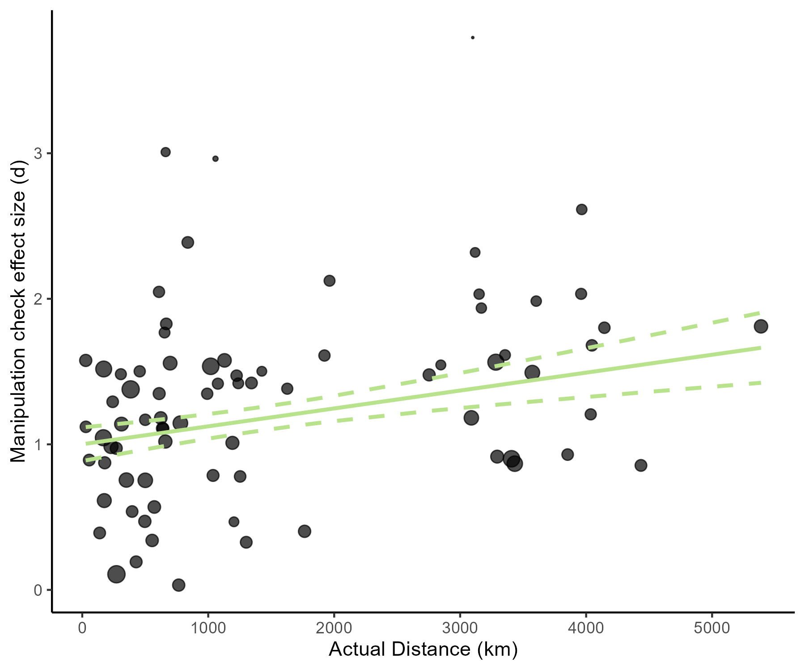

# Does the actual distance between the cities used in the spatial distance manipulation influence the effect of the manipulation on the BIF?

```{r}
lrt_km_spatial
```

```{r}
summary(glmm_spatial_km_base)
```

```{r}
summary(glmm_spatial_km_add)
```

```{r}
summary(glmm_spatial_km_int)
```

# Does the actual distance between the cities used in the spatial distance manipulation influence the strength of the spatial distance manipulation?

```{r}
meta_spatial_mc_km
```

```{r}

```

