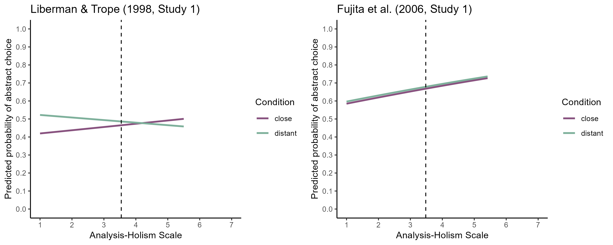

# Analysis-Holism Scale

## Liberman & Trope (1998, Study 1)

```{r}
lrt_ahs_temporal
```

```{r}
summary(glmm_temporal_ahs_base)
```

```{r}
summary(glmm_temporal_ahs_add)
```

```{r}
summary(glmm_temporal_ahs_int)
```

## Fujita et al. (2006, Study 1)

```{r}
lrt_ahs_spatial
```

```{r}
summary(glmm_spatial_ahs_base)
```

```{r}
summary(glmm_spatial_ahs_add)
```

```{r}
summary(glmm_spatial_ahs_int)
```

## Social Distance (Paradigmatic Replication)

```{r}
lrt_ahs_social
```

```{r}
summary(glmm_social_ahs_base)
```

```{r}
summary(glmm_social_ahs_add)
```

```{r}
summary(glmm_social_ahs_int)
```

## Likelihood Distance (Paradigmatic Replication)

```{r}
lrt_ahs_likelihood
```

```{r}
summary(glmm_likelihood_ahs_base)
```

```{r}
summary(glmm_likelihood_ahs_add)
```

```{r}
summary(glmm_likelihood_ahs_int)
```

# Visualization of Predicted Probabilities

```{r}

```

