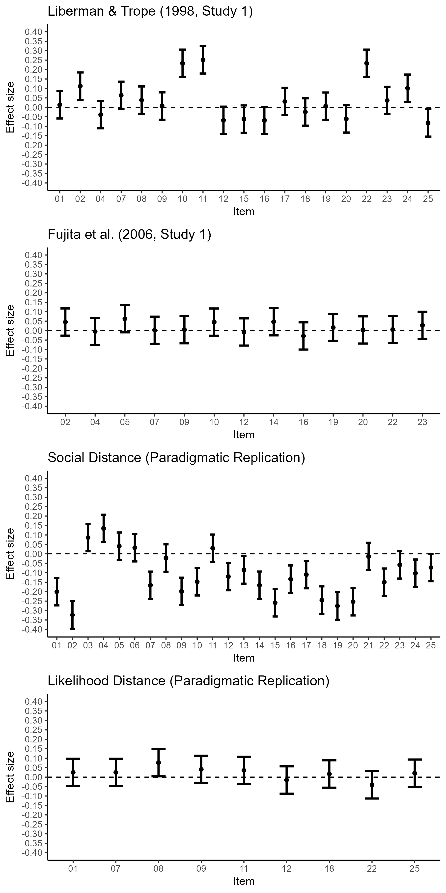
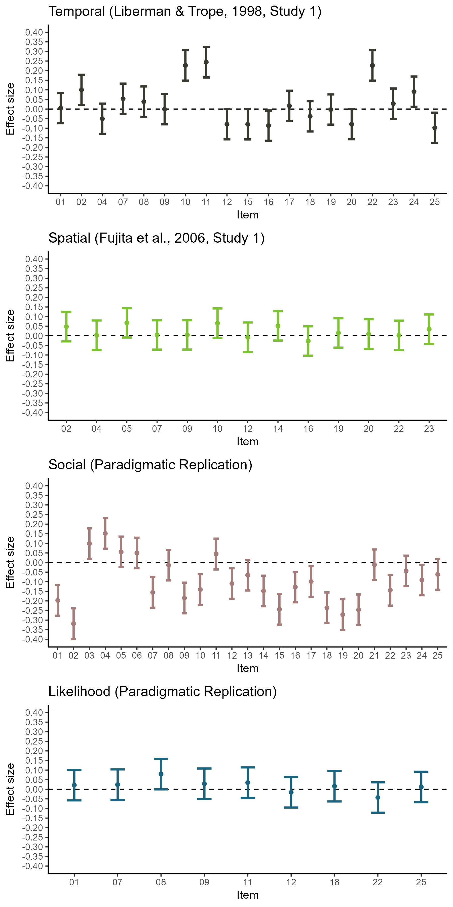

# Overview

## Effects calculated from raw data

```{r}

```

## Effects calculated meta-analytically

```{r}

```

# Liberman & Trope (1998, Study 1)

## Effects calculated from raw data 

```{r}
item_effects_temporal
```

## Meta-Analytic Approach

```{r}
meta_temporal_bif_item
```


# Fujita et al. (2006, Study 1)

## Effects calculated from raw data

```{r}
item_effects_spatial
```

## Meta-Analytic Approach

```{r}
meta_spatial_bif_item
```

# Social Distance (Paradigmatic Replication)

## Effects calculated from raw data

```{r}
item_effects_social
```

## Meta-Analytic Approach

```{r}
meta_social_bif_item
```

# Likelihood Distance (Paradigmatic Replication)

## Effects calculated from raw data

```{r}
item_effects_likelihood
```

## Meta-Analytic Approach

```{r}
meta_likelihood_bif_item
```
