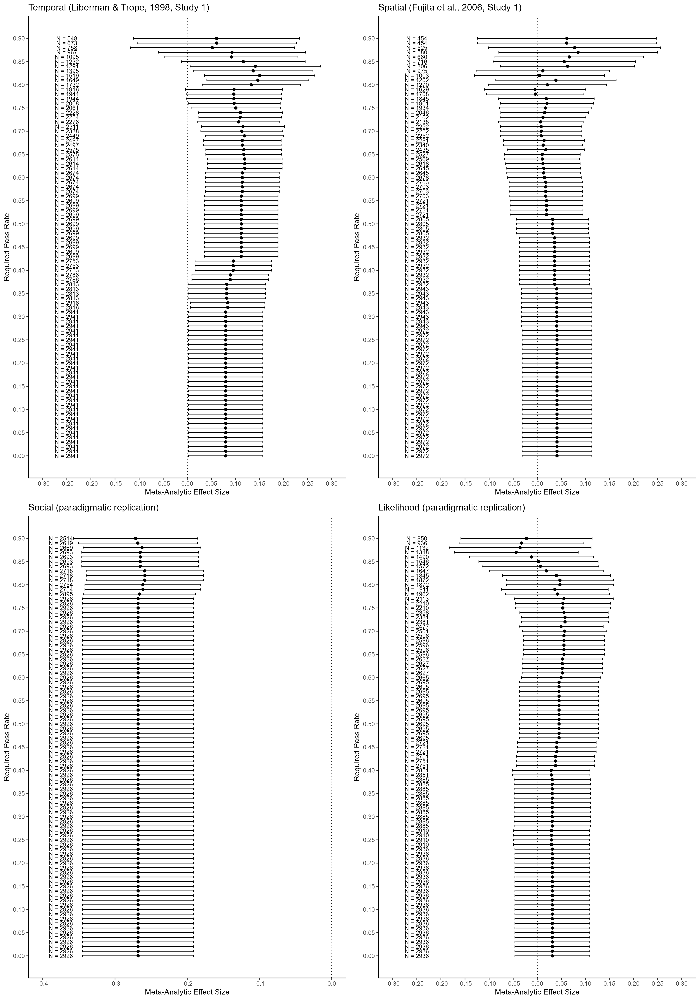
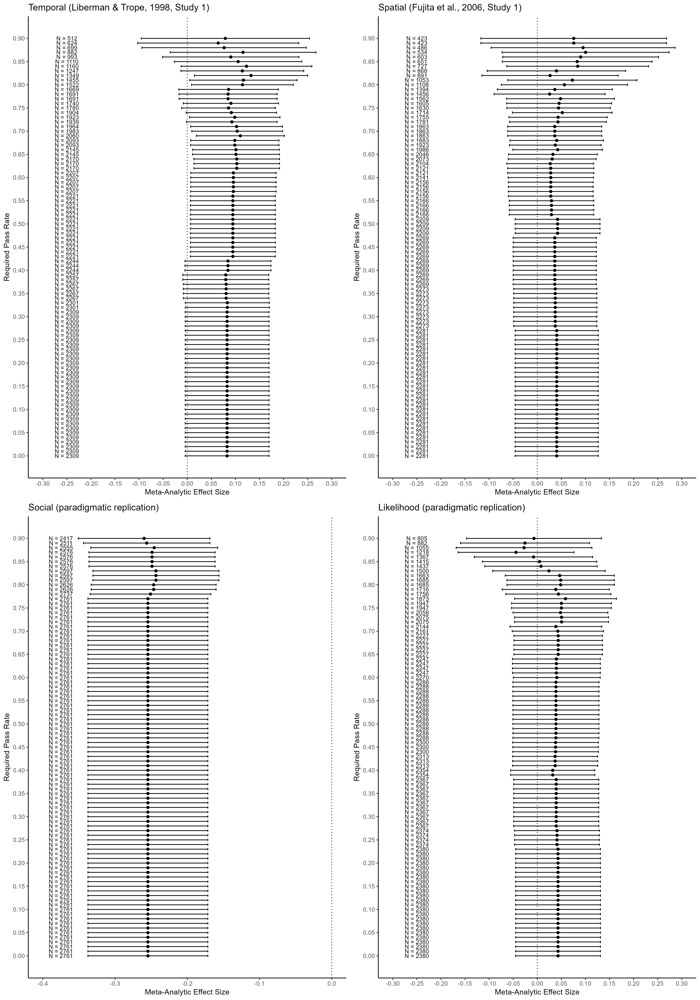

# Impact of Excluding Samples Based on the Rate of Comprehension Check Failures

## Excluding samples

The figure below can be interpreted as follows: The y-axis indicates the
required rate of participants passing the comprehension check in order to be
included in the analyses. Thus, the higher on the y-axis, the stricter the
criterion. Each point represents the meta-analytic point estimate after the
exclusions. Error bars represent 95% confidence intervals. Sample sizes are
provided on the left side of the plot. A dotted vertical line is drawn at zero.

```{r}

```

## Removing cases at an individual level also

The following figure can be interpreted the same as above, but in these data,
individual participants failing the comprehension check were also excluded.

```{r}

```


