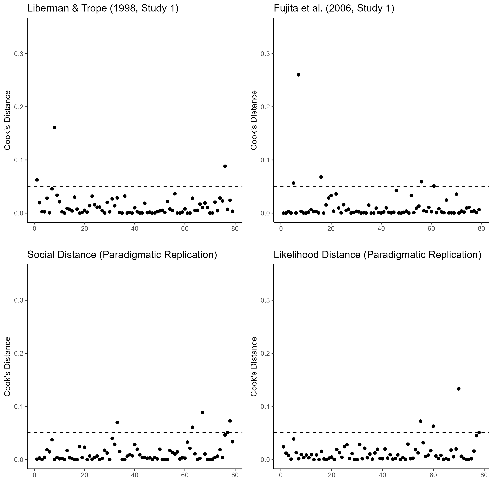

# Overview of Cook's Distances

```{r}

```

# Liberman & Trope (1998, Study 1) - Influential cases removed

```{r}
meta_temporal_inf
```

# Fujita et al. (2006, Study 1) - Influential cases removed

```{r}
meta_spatial_inf
```

# Social Distance (Paradigmatic Replication) - Influential cases removed

```{r}
meta_social_inf
```

# Likelihood Distance (Paradigmatic Replication) - Influential cases removed

```{r}
meta_likelihood_inf
```
