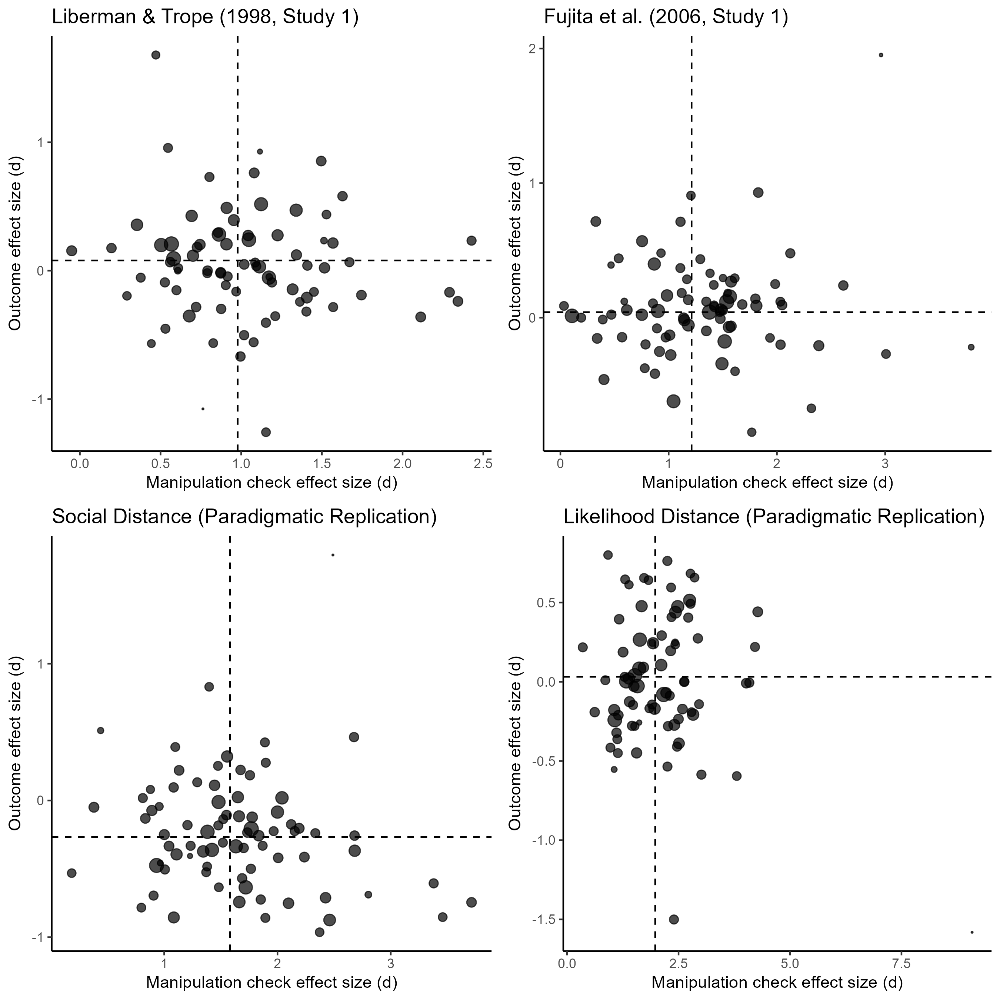

# Overview

```{r}

```

# Liberman & Trope (1998, Study 1)

```{r}
meta_temporal_ce
```

# Fujita et al. (2006, Study 1)

```{r}
meta_spatial_ce
```

# Social Distance (Paradigmatic Replication)

```{r}
meta_social_ce
```

# Likelihood Distance (Paradigmatic Replication)

```{r}
meta_likelihood_ce
```

