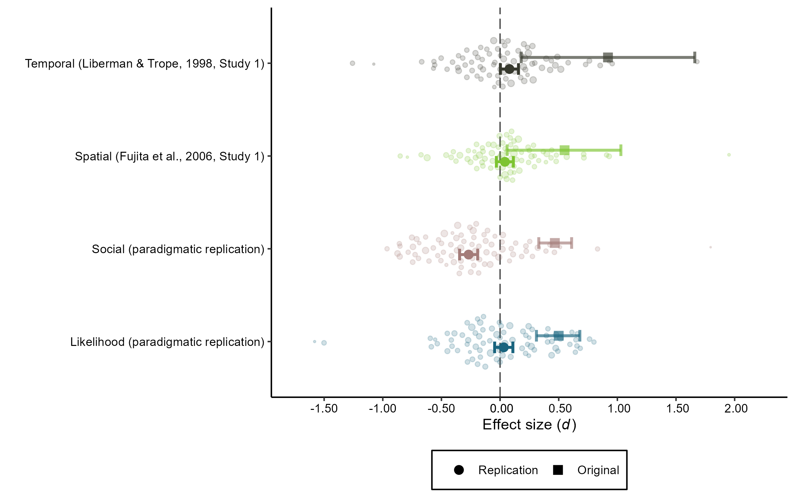

```{r setup, include=FALSE}
knitr::opts_chunk$set(echo = TRUE)

```

# Main Figure

```{r}

```


# Meta-Analytic Models

## Liberman & Trope (1998, Study 1)

```{r}
meta_temporal
```

```{r}
bt_temporal
```

```{r}
predict(meta_temporal)
```

## Fujita et al. (2006, Study 1)

```{r}
meta_spatial
```

```{r}
bt_spatial
```

```{r}
predict(meta_spatial)
```

## Social Distance (Paradigmatic Replication)

```{r}
meta_social
```

```{r}
bt_social
```

```{r}
predict(meta_social)
```

## Likelihood Distance (Paradigmatic Replication)

```{r}
meta_likelihood
```

```{r}
bt_likelihood
```

```{r}
predict(meta_likelihood)
```

# Arboretum

```{r}

```
