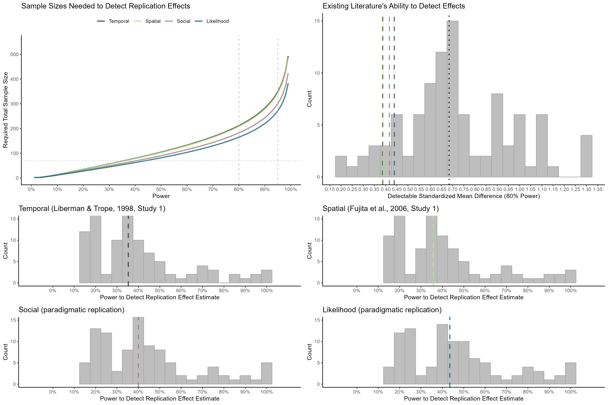

# **THESE RESULTS ARE SIMULATED. DO NOT INTERPRET.**

# Power Figure

```{r}

```


# Power Analyses for Each Replication

## Liberman & Trope (1998, Study 1)

### What sample sizes are needed for 80% and 95% power to detect the replication effect?

```{r}
power_80_n_temporal
```

```{r}
power_95_n_temporal
```

### What proportion of effects for which previous experiments had 80% power is the replication effect smaller than?

```{r}
smaller_prop_temporal
```

### What is the median power for the replication effect that the previous experiments samples provided?

```{r}
median_power_temporal
```

## Fujita et al. (2006, Study 1)


### What sample sizes are needed for 80% and 95% power to detect the replication effect?

```{r}
power_80_n_spatial
```

```{r}
power_95_n_spatial
```

### What proportion of effects for which previous experiments had 80% power is the replication effect smaller than?

```{r}
smaller_prop_spatial
```

### What is the median power for the replication effect that the previous experiments samples provided?

```{r}
median_power_spatial
```

## Social Distance (Paradigmatic Replication)


### What sample sizes are needed for 80% and 95% power to detect the replication effect?

```{r}
power_80_n_social
```

```{r}
power_95_n_social
```

### What proportion of effects for which previous experiments had 80% power is the replication effect smaller than?

```{r}
smaller_prop_social
```

### What is the median power for the replication effect that the previous experiments samples provided?

```{r}
median_power_social
```

## Likelihood Distance (Paradigmatic Replication)

### What sample sizes are needed for 80% and 95% power to detect the replication effect?

```{r}
power_80_n_likelihood
```

```{r}
power_95_n_likelihood
```

### What proportion of effects for which previous experiments had 80% power is the replication effect smaller than?

```{r}
smaller_prop_likelihood
```

### What is the median power for the replication effect that the previous experiments samples provided?

```{r}
median_power_likelihood
```
