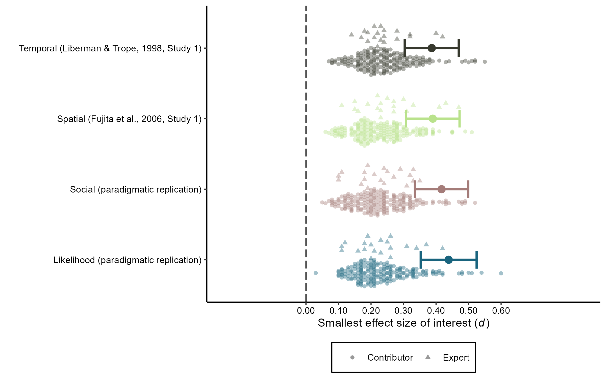

```{r setup, include=FALSE}
knitr::opts_chunk$set(echo = TRUE)
```

# **THESE RESULTS ARE SIMULATED. DO NOT INTERPRET.**

# Primary SEOI Visualization

```{r}

```

# Frequencies and Proportions of Excluded SEOI Estimates

## Liberman & Trope (1998, Study 1)

```{r}
seoi_temporal
```

## Fujita et al. (2006, Study 1)

```{r}
seoi_spatial
```

## Social Distance (Conceptual Replication)

```{r}
seoi_social
```

## Likelihood Distance (Conceptual Replication)

```{r}
seoi_likelihood
```
