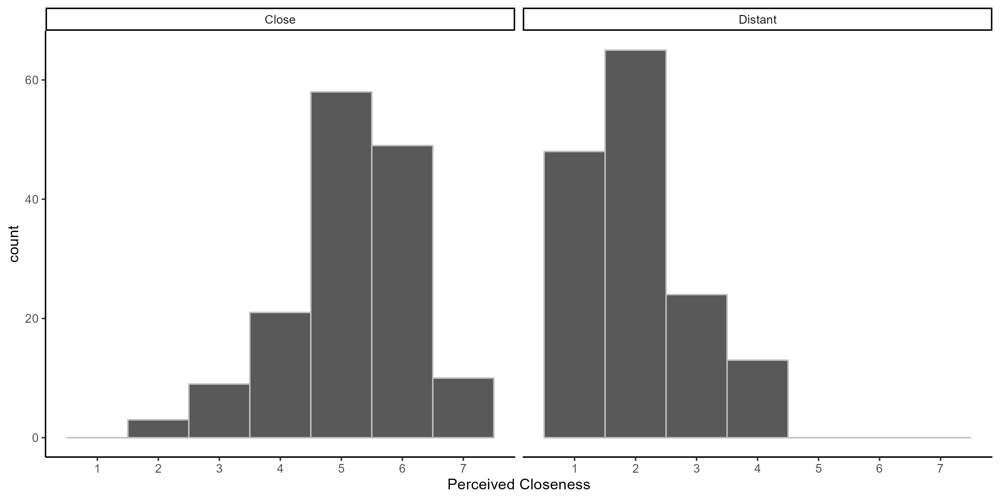

```{r setup, include=FALSE}
knitr::opts_chunk$set(echo = TRUE)

```

# Overview

The documentation for this pretest is provided here: https://osf.io/ahyvj/

# Effect of Social Distance Manipulation on Ratings of Closeness

```{r}
distance_d
```

```{r}

```

```{r}
close_cor_mat
```

# Effects of Social Distance on Other Variables

```{r}
supplement_d
```

