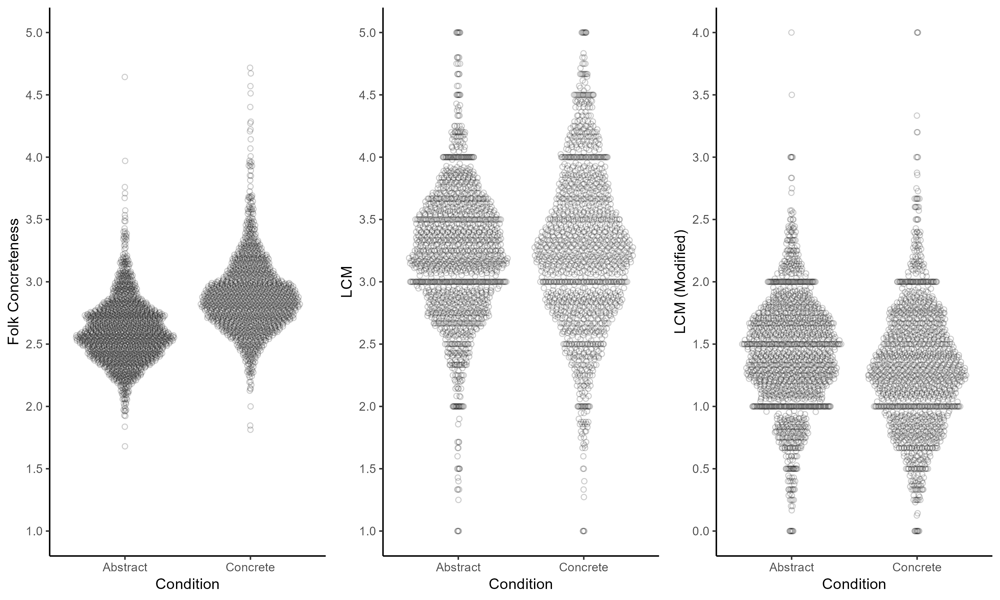
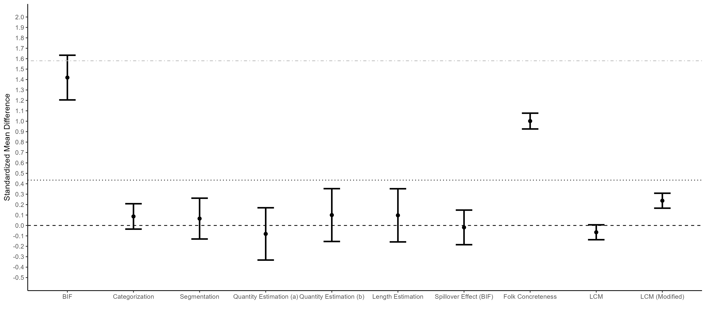

```{r setup, include=FALSE}
knitr::opts_chunk$set(echo = TRUE)

```

These validations are documented here: https://osf.io/kgrs9/

Previous relevant analyses by the Puddle-Ducks can be found here: https://www.rabbitsnore.com/2019/02/there-might-be-problems-with-automated.html

# Linguistic Measures of Concreteness/Abstraction

## Standarized mean differences

```{r}
d_folk
```

```{r}
d_lcm
```

```{r}
d_lcm_pd
```

```{r}

```

## Linear mixed effects models

```{r}
summary(lmer_folk)
```


```{r}
summary(lmer_lcm)
```

```{r}
summary(lmer_lcm_pd)
```

# Additional LCM Analyses

## Effect for Activities Only

```{r}
d_lcm_ac
```

```{r}
summary(lmer_lcm_ac)
```

## Effect for Activities Only (Modified Puddle-Ducks Version)

```{r}
d_lcm_pd_ac
```

```{r}
summary(lmer_lcm_pd_ac)
```

# Summary of Validations Studies

```{r}
validation_plot_data
```

```{r}

```


