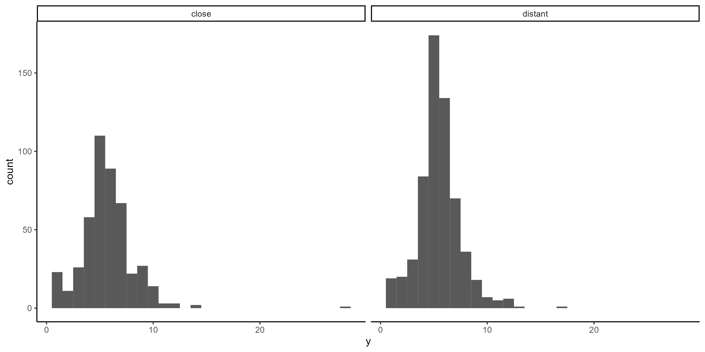
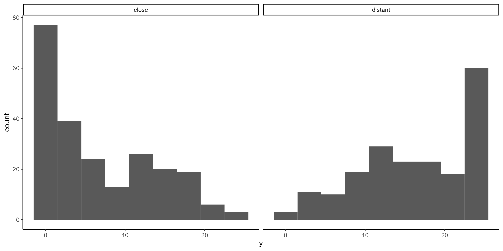

```{r setup, include=FALSE}
knitr::opts_chunk$set(echo = TRUE)

```

These validation studies are documented here: https://osf.io/kgrs9/

# Categorization Task

```{r}
effect_temporal
```

```{r}
knitr::include_graphics("./figures/climr_validation-temporal-hist.png")
```

# Segmentation Task

```{r}
effect_spatial
```

```{r}

```

# Behavior Identification Form

```{r}
effect_temporal_2
```

```{r}

```

# Robustness Checks

## Categorization Task

```{r}
effect_temporal_cc
```

### Mixed effects model based effect size

```{r}
emm_temporal
```

## Segmentation Task

```{r}
effect_spatial_cc
```

## Behavior Identification Form

```{r}
effect_temporal_2_cc
```
