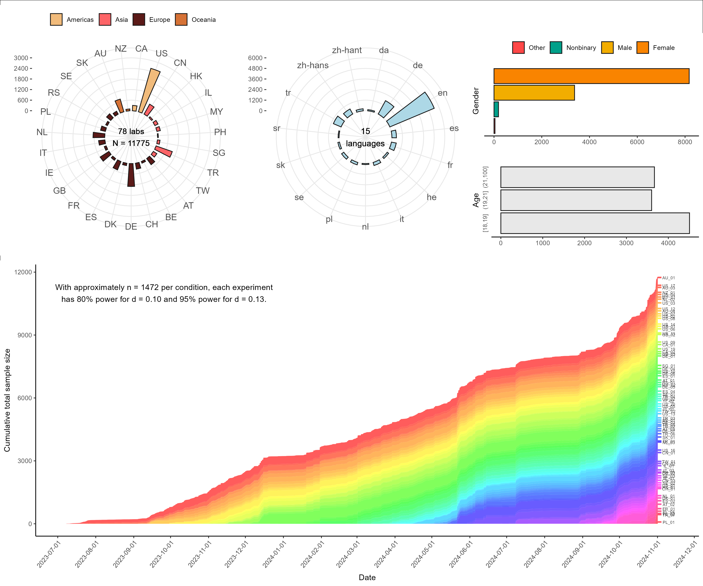

# Construal Level International Multi-lab Replication (CLIMR) Project

This project entails multi-lab collaborative replications of studies on
Construal Level Theory (CLT):

Liberman, N., & Trope, Y. (1998). The role of feasibility and desirability
considerations in near and distant future decisions: A test of temporal
construal theory. *Journal of Personality and Social Psychology, 75*(1), 5-18.
Study 1.

Fujita, K., Henderson, M., Eng, J., Trope, Y., & Liberman, N. (2006). Spatial
distance and mental construal of social events. *Psychological Science, 14*,
278-282. Study 1.

In addition to close replications of these two studies, this project also
includes two paradigmatic replications relevant to social and likelihood
distance.

The CLIMR project is a collaboration of 78 labs, across 27 countries, featuring
15 languages.

## Compendium Structure

The CLIMR project compendium comprises two main parts, one hosted on the Open
Science Framework (OSF; https://osf.io/ra3dp/) and one hosted on GitHub
(https://github.com/RabbitSnore/CLIMR). The OSF repository for CLIMR contains
the materials, methods, and data (when data are collected). The OSF repository
also contains the registration documentation and Stage 1 manuscript for the
registered report for the primary results of the project. The GitHub repository
contains the code necessary to execute and reproduce the statistical analyses
for the project.

This repository is structured as follows:  

- The source file for compiling the project is located in the root directory.  
- The source files to render analysis reports (i.e., `.Rmd` files) in the root
directory.  
- The source files for data wrangling, visualization, simulation,
effect calculation, and analysis are located in the `/R/` directory.  
- Rendered figures are located in the `/figures/` directory.  
- Some data are located in the `/data/` directory, and data required for
analyses will be downloaded automatically from the Open Science Framework as
required.
- Rendered reports are located in the `/reports/` directory.

## (Re-)Building the Project

If you want to reproduce the analyses and output for the CLIMR project, the most
straightforward way to do this is to clone this repository into an RStudio
project. [This
webpage](https://resources.github.com/whitepapers/github-and-rstudio/) has
information about how to clone repositories in RStudio. Once you have cloned
the repository, open the project in RStudio, and run the following code:

> `source("CLIMR_build-project.R")`

Running this script will install all necessary packages and build the project,
including all effect size calculations, meta-analytic models, data
visualizations, and reports.

Additionally, `CLIMR_build-project.R` includes parameters that control its
operations (e.g., whether to run a simulation or load data files). These
parameters must be changed manually, and they should only be changed if you know
what you are doing.

Additional supplemental materials are available on the Open Science Framework:
https://osf.io/ra3dp/

### Technical Information for Reproducibility

The CLIMR project analysis code was built using R 4.3.2. The packages required
for the project are tracked with the `renv` package. Guidance on how to use the
renv package can be found
[here](https://docs.posit.co/ide/user/ide/guide/environments/r/renv.html)

If you are reproducing the analyses for the first time, before running the
script to build the project, you will need to install all necessary packages (in
their correct version). The parameters of the build script are set to perform
these installations by default. Note that this process can be time consuming and
may require user input to confirm the installations. Alternatively, to do this
manually, make sure that `renv` is installed, and run `renv::restore()`.

## Readable Reports

Reports of the the main analyses, supplemental analyses, and preliminary studies
are available in the `/reports/` directory. These reports are rendered in a
format that is readable on GitHub.

### Primary Results

The primary results of the replications are available in the reports linked
below.

- [Main Analyses](reports/CLIMR_main-analysis_report.md)
- [Comprehension Check Analyses](reports/CLIMR_comprehension-check_report.md)
- [Manipulation Check Analyses](reports/CLIMR_manipulation-check_report.md)
- [Power Analyses](reports/CLIMR_power_report.md)
- [BIF Response Option Valence Robustness Checks](reports/CLIMR_valence-robustness-check_report.md)

### Validation Studies

In part to assist with the selection of studies that would be theoretically
informative to replicate, we have conducted a series of studies assessing
measures of mental abstraction/concreteness. These validations studies are
reported in a preprint available here: https://osf.io/preprints/psyarxiv/v6xt4

- [Validation Study 1: BIF, Categorization, Segmentation](reports/CLIMR_validation_report.md)
- [Validation Study 2: Interval Estimation](reports/CLIMR_validation-2_report.md)
- [Validation Study 3: Linguistic Measures](reports/CLIMR_validation-3_report.md)

### Pretests and Examination of Outcome Measures

To address reviewer concerns and to validate the procedures used in the
replication studies, we have conducted a series of pretests and assessments of
potential sources of error. These analyses are reported in the documents linked
below.

- [Differntial Effects on BIF Items](reports/CLIMR_bif_report.md)
- [Relevance of BIF Items to Target Event](reports/CLIMR_action-relevance-pretest_report.md)
- [Valence of BIF Response Options](reports/CLIMR_bif-valence-pretest_report.md)
- [Pretest of Social Distance Manipulation](reports/CLIMR_social-distance-pretest_report.md)

### Exploratory and Post Hoc Analyses

In addition to the planned analyses, we conducted several exploratory and post
hoc analyses of the data.

- [Spatial Experiment: Online Location Check Analysis](reports/CLIMR_spatial-robustness_report.md)
- [Additional BIF Response Option Valence Difference Analyses: Random Slopes Models and Full Scales](reports/exploration-valence-additional_report.md)
- [Scale Reliability of the BIF](reports/exploration-reliability_report.md)
- [Cause Size and Effect Size Analysis](reports/exploration-manipulation-checks_report.md)
- [Analysis of Influential Cases](reports/exploration-influence_report.md)
- [Analysis of Country and Language](reports/exploration-country-language_report.md)
- [Analysis of Effects on Individual BIF Items](reports/exploration-bif-items_report.md)
- [Reanalysis of Data from Previous CLT Research](reports/exploration-past-data_report.md)
- [Potential Moderating Effect of the Analysis-Holism Scale](reports/exploration-ahs_report.md)
- [Potential Moderating Effect of Positive and Negative Affect](reports/exploration-panas_report.md)
