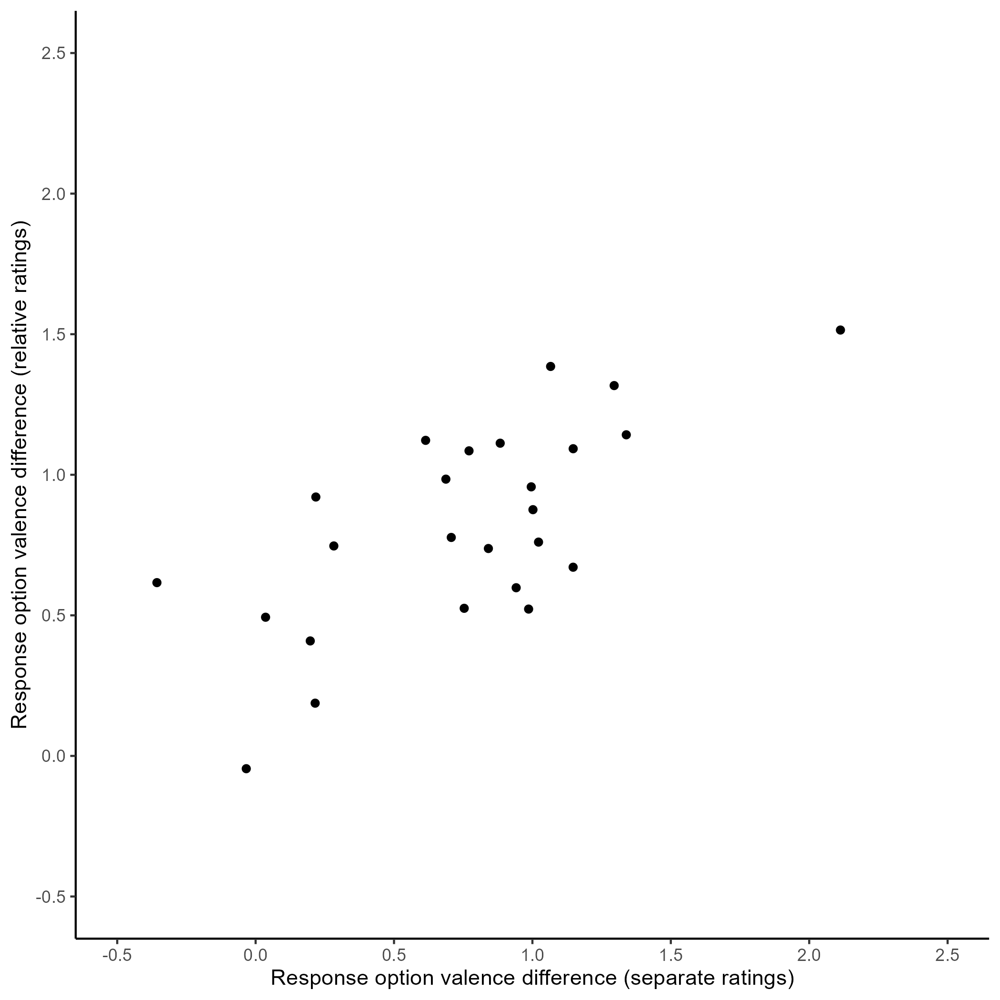

Construal Level International Multilab Replication (CLIMR) Project:
Pretest of Valence Differences in BIF Item Response Options
================
CLIMR Team
2022-11-22

# Overview

The documentation for this pretest is provided here:
<https://osf.io/g6d5v>

# Separate Judgments of Item Response Options

When judged separately, the response options for each item are generally
rated such that the abstract option is more positively valenced than the
concrete option.

``` r
bif_d_sep %>% 
  knitr::kable()
```

| item   |          d |       var |   ci_lower |   ci_upper |
|:-------|-----------:|----------:|-----------:|-----------:|
| bif_01 |  0.9413056 | 0.0074075 |  0.7722754 |  1.1103358 |
| bif_02 |  2.1128505 | 0.0103992 |  1.9125748 |  2.3131263 |
| bif_03 |  0.6141789 | 0.0069821 |  0.4500746 |  0.7782832 |
| bif_04 |  0.1974207 | 0.0066993 |  0.0366743 |  0.3581671 |
| bif_05 |  0.7535554 | 0.0071415 |  0.5875886 |  0.9195222 |
| bif_06 |  1.0019380 | 0.0075060 |  0.8317875 |  1.1720884 |
| bif_07 |  0.8409323 | 0.0072579 |  0.6736173 |  1.0082472 |
| bif_08 |  0.2151093 | 0.0067054 |  0.0542897 |  0.3759288 |
| bif_09 |  1.3391569 | 0.0081661 |  1.1616825 |  1.5166313 |
| bif_10 |  0.6873452 | 0.0070617 |  0.5223079 |  0.8523825 |
| bif_11 | -0.0337728 | 0.0066676 | -0.1941392 |  0.1265936 |
| bif_12 |  1.0657412 | 0.0076163 |  0.8943451 |  1.2371373 |
| bif_13 | -0.3565716 | 0.0067730 | -0.5182000 | -0.1949432 |
| bif_14 |  1.1470927 | 0.0077669 |  0.9740113 |  1.3201742 |
| bif_15 |  0.2175529 | 0.0067062 |  0.0567227 |  0.3783831 |
| bif_16 |  1.2953358 | 0.0080696 |  1.1189134 |  1.4717581 |
| bif_17 |  0.7068331 | 0.0070844 |  0.5415305 |  0.8721356 |
| bif_18 |  0.2825103 | 0.0067334 |  0.1213547 |  0.4436658 |
| bif_19 |  0.9862716 | 0.0074800 |  0.8164166 |  1.1561266 |
| bif_20 |  0.8836155 | 0.0073195 |  0.7155926 |  1.0516383 |
| bif_21 |  0.0359620 | 0.0066677 | -0.1244060 |  0.1963299 |
| bif_22 |  0.9957628 | 0.0074957 |  0.8257293 |  1.1657963 |
| bif_23 |  1.0221313 | 0.0075402 |  0.8515940 |  1.1926687 |
| bif_24 |  1.1472808 | 0.0077672 |  0.9741953 |  1.3203662 |
| bif_25 |  0.7709744 | 0.0071637 |  0.6047498 |  0.9371991 |

Combining across the items, the valence difference in response options
appears to be non-trivial.

``` r
bif_scale_smd_sep
```

    ##           d          var  ci_lower  ci_upper
    ## 1 0.6701145 0.0002816371 0.6372197 0.7030094

# Relative Judgments of Item Response Options

When judged relatively, the response options for each item are again
generally rated such that the abstract option is more positively
valenced than the concrete option.

``` r
bif_d_rel %>% 
  knitr::kable()
```

| item   |          d |        se |   ci_lower |  ci_upper |          m |       sd |
|:-------|-----------:|----------:|-----------:|----------:|-----------:|---------:|
| bif_01 |  0.5982161 | 0.1161980 |  0.4847880 | 0.7116441 |  1.2059801 | 2.015961 |
| bif_02 |  1.5147968 | 0.0871541 |  1.4011784 | 1.6284153 |  2.2866667 | 1.509553 |
| bif_03 |  1.1224132 | 0.0876166 |  1.0087948 | 1.2360317 |  1.7033333 | 1.517564 |
| bif_04 |  0.4089737 | 0.1105836 |  0.2953552 | 0.5225922 |  0.7833333 | 1.915364 |
| bif_05 |  0.5250311 | 0.1084988 |  0.4114127 | 0.6386496 |  0.9866667 | 1.879254 |
| bif_06 |  0.8758698 | 0.0874504 |  0.7622514 | 0.9894883 |  1.3266667 | 1.514685 |
| bif_07 |  0.7377306 | 0.0967819 |  0.6241121 | 0.8513490 |  1.2366667 | 1.676312 |
| bif_08 |  0.1876123 | 0.1118107 |  0.0739938 | 0.3012307 |  0.3633333 | 1.936618 |
| bif_09 |  1.1421659 | 0.0901452 |  1.0285474 | 1.2557843 |  1.7833333 | 1.561361 |
| bif_10 |  0.9844226 | 0.0930558 |  0.8708042 | 1.0980411 |  1.5866667 | 1.611774 |
| bif_11 | -0.0454410 | 0.1185845 | -0.1590595 | 0.0681774 | -0.0933333 | 2.053944 |
| bif_12 |  1.3852819 | 0.0818267 |  1.2716635 | 1.4989004 |  1.9633333 | 1.417281 |
| bif_13 |  0.6163511 | 0.1080354 |  0.5027326 | 0.7299695 |  1.1533333 | 1.871228 |
| bif_14 |  0.6711846 | 0.0937614 |  0.5575661 | 0.7848030 |  1.0900000 | 1.623994 |
| bif_15 |  0.9208700 | 0.0875657 |  0.8072515 | 1.0344885 |  1.3966667 | 1.516682 |
| bif_16 |  1.3172455 | 0.0888290 |  1.2036270 | 1.4308640 |  2.0266667 | 1.538564 |
| bif_17 |  0.7770732 | 0.1022837 |  0.6634547 | 0.8906916 |  1.3766667 | 1.771605 |
| bif_18 |  0.7468055 | 0.1028214 |  0.6331870 | 0.8604239 |  1.3300000 | 1.780919 |
| bif_19 |  0.5222942 | 0.1123836 |  0.4086757 | 0.6359127 |  1.0166667 | 1.946540 |
| bif_20 |  1.1122755 | 0.0903184 |  0.9986570 | 1.2258940 |  1.7400000 | 1.564361 |
| bif_21 |  0.4932722 | 0.1041700 |  0.3796537 | 0.6068907 |  0.8900000 | 1.804278 |
| bif_22 |  0.9570535 | 0.0862659 |  0.8434351 | 1.0706720 |  1.4300000 | 1.494169 |
| bif_23 |  0.7605244 | 0.1057746 |  0.6469060 | 0.8741429 |  1.3933333 | 1.832069 |
| bif_24 |  1.0926688 | 0.0900017 |  0.9790503 | 1.2062873 |  1.7033333 | 1.558874 |
| bif_25 |  1.0851368 | 0.0803400 |  0.9715184 | 1.1987553 |  1.5100000 | 1.391530 |

Combining across the items, the valence difference across items appears
to be slightly larger for relative judgments than for separate
judgments.

``` r
bif_scale_smd_rel
```

    ##           d         se  ci_lower  ci_upper        m       sd
    ## 1 0.7484497 0.02048004 0.7258158 0.7710835 1.327556 1.773742

There is a strong correspondence between the separate and relative
judgments.

<!-- -->

Item 13, which concerns voting, appeared to have discrepant results in
the two judgment modes. This may be because the abstract option
(“influencing an election”) could come across as nefarious when viewed
in isolation.

# Examination of the Effects of Valence Differences on Response Patterns

To assess the extent to which these valence differences might influence
people’s responses to the BIF items, especially in an situation in which
there is a plausible motvation to provide more positive responses under
some conditions, we examined the data from Yan et al (2016, Experiment
3, 10.1093/jcr/ucw045). In this experiment, participants were provided
with a description of a socially close or socially distant target and
asked to complete the BIF. It is plausible that people would want to
provide more positive responses for a socially close target, not for any
reason related to construal level but for motivational reasons.

The authors of this experiment graciously provided the original data,
which we used to fit models in which we predicted BIF responses using
the social distance manipulation and the BIF valence differences.

As a first look, we fit models predicting BIF responses from the
distance manipulation and tested whether adding random slopes for the
items improved the fit of the model. If there is substantial variance in
the random slopes, that would be an indication that there may extraneous
influences (e.g., valence) on the BIF responses. However, a likelihood
ratio test indicates that there is no significant improvement to the
model offered by adding random slopes.

``` r
lrt_rs
```

    ## Data: yan_exp_3_long
    ## Models:
    ## model_soc: bif ~ mani_social + (1 | id) + (1 | item)
    ## model_rs: bif ~ mani_social + (1 | id) + (1 + mani_social | item)
    ##           npar    AIC    BIC  logLik deviance  Chisq Df Pr(>Chisq)
    ## model_soc    4 6199.2 6225.1 -3095.6   6191.2                     
    ## model_rs     6 6200.8 6239.7 -3094.4   6188.8 2.3869  2     0.3032

Next, we can examine the effect of adding the valence difference for
each item as a predictor in the model and also test if adding an
interaction between valence and the distance manipulation improves the
model.

We see below that a series of LRTs indicates that adding valence does
not offer significant improvement to the model, nor does adding the
interaction term.

``` r
lrt_val_sep
```

    ## Data: yan_exp_3_long
    ## Models:
    ## model_soc: bif ~ mani_social + (1 | id) + (1 | item)
    ## model_val_sep: bif ~ mani_social + d_sep_mc + (1 | id) + (1 | item)
    ## model_val_sep_int: bif ~ mani_social * d_sep_mc + (1 | id) + (1 | item)
    ##                   npar    AIC    BIC  logLik deviance  Chisq Df Pr(>Chisq)
    ## model_soc            4 6199.2 6225.1 -3095.6   6191.2                     
    ## model_val_sep        5 6198.9 6231.3 -3094.5   6188.9 2.2583  1     0.1329
    ## model_val_sep_int    6 6200.3 6239.2 -3094.2   6188.3 0.6236  1     0.4297

It can nevertheless be informative to examine the detailed model output.

As can be seen below, if the valence differences (as measured by the
separate judgments) had any influence on the responses to the BIF in
this experiment, those differences were minimal. Moreover, controlling
for the valence differences did not meaningfully change the estimate of
the effect of social distance, suggesting that those effects were
non-redundant.

``` r
summary(model_soc)
```

    ## Generalized linear mixed model fit by maximum likelihood (Laplace Approximation) ['glmerMod']
    ##  Family: binomial  ( logit )
    ## Formula: bif ~ mani_social + (1 | id) + (1 | item)
    ##    Data: yan_exp_3_long
    ## 
    ##      AIC      BIC   logLik deviance df.resid 
    ##   6199.2   6225.1  -3095.6   6191.2     4821 
    ## 
    ## Scaled residuals: 
    ##     Min      1Q  Median      3Q     Max 
    ## -2.6705 -1.0386  0.5679  0.7572  1.7042 
    ## 
    ## Random effects:
    ##  Groups Name        Variance Std.Dev.
    ##  id     (Intercept) 0.3429   0.5856  
    ##  item   (Intercept) 0.1125   0.3355  
    ## Number of obs: 4825, groups:  id, 193; item, 25
    ## 
    ## Fixed effects:
    ##              Estimate Std. Error z value Pr(>|z|)    
    ## (Intercept)   0.46244    0.09806   4.716  2.4e-06 ***
    ## mani_social2  0.19130    0.10537   1.816   0.0694 .  
    ## ---
    ## Signif. codes:  0 '***' 0.001 '**' 0.01 '*' 0.05 '.' 0.1 ' ' 1
    ## 
    ## Correlation of Fixed Effects:
    ##             (Intr)
    ## mani_socil2 -0.493

``` r
summary(model_val_sep)
```

    ## Generalized linear mixed model fit by maximum likelihood (Laplace Approximation) ['glmerMod']
    ##  Family: binomial  ( logit )
    ## Formula: bif ~ mani_social + d_sep_mc + (1 | id) + (1 | item)
    ##    Data: yan_exp_3_long
    ## 
    ##      AIC      BIC   logLik deviance df.resid 
    ##   6198.9   6231.3  -3094.5   6188.9     4820 
    ## 
    ## Scaled residuals: 
    ##     Min      1Q  Median      3Q     Max 
    ## -2.6521 -1.0360  0.5676  0.7574  1.7126 
    ## 
    ## Random effects:
    ##  Groups Name        Variance Std.Dev.
    ##  id     (Intercept) 0.3428   0.5855  
    ##  item   (Intercept) 0.1007   0.3173  
    ## Number of obs: 4825, groups:  id, 193; item, 25
    ## 
    ## Fixed effects:
    ##              Estimate Std. Error z value Pr(>|z|)    
    ## (Intercept)   0.46245    0.09561   4.837 1.32e-06 ***
    ## mani_social2  0.19130    0.10537   1.816   0.0694 .  
    ## d_sep_mc      0.21045    0.13682   1.538   0.1240    
    ## ---
    ## Signif. codes:  0 '***' 0.001 '**' 0.01 '*' 0.05 '.' 0.1 ' ' 1
    ## 
    ## Correlation of Fixed Effects:
    ##             (Intr) mn_sc2
    ## mani_socil2 -0.505       
    ## d_sep_mc     0.003  0.001

``` r
summary(model_val_sep_int)
```

    ## Generalized linear mixed model fit by maximum likelihood (Laplace Approximation) ['glmerMod']
    ##  Family: binomial  ( logit )
    ## Formula: bif ~ mani_social * d_sep_mc + (1 | id) + (1 | item)
    ##    Data: yan_exp_3_long
    ## 
    ##      AIC      BIC   logLik deviance df.resid 
    ##   6200.3   6239.2  -3094.2   6188.3     4819 
    ## 
    ## Scaled residuals: 
    ##     Min      1Q  Median      3Q     Max 
    ## -2.6455 -1.0384  0.5652  0.7569  1.6884 
    ## 
    ## Random effects:
    ##  Groups Name        Variance Std.Dev.
    ##  id     (Intercept) 0.3428   0.5855  
    ##  item   (Intercept) 0.1008   0.3174  
    ## Number of obs: 4825, groups:  id, 193; item, 25
    ## 
    ## Fixed effects:
    ##                       Estimate Std. Error z value Pr(>|z|)    
    ## (Intercept)            0.46296    0.09563   4.841 1.29e-06 ***
    ## mani_social2           0.19017    0.10537   1.805   0.0711 .  
    ## d_sep_mc               0.25409    0.14760   1.721   0.0852 .  
    ## mani_social2:d_sep_mc -0.09648    0.12179  -0.792   0.4282    
    ## ---
    ## Signif. codes:  0 '***' 0.001 '**' 0.01 '*' 0.05 '.' 0.1 ' ' 1
    ## 
    ## Correlation of Fixed Effects:
    ##             (Intr) mn_sc2 d_sp_m
    ## mani_socil2 -0.506              
    ## d_sep_mc     0.006 -0.005       
    ## mn_scl2:d__ -0.007  0.012 -0.375

We can take a similar approach with the relative judgments. Below, we
see that adding the valence differences measured with relative judgments
offered significant improvement to the model, though the interaction
between social distance and the valence differences was again
nonsignificant.

``` r
lrt_val_rel
```

    ## Data: yan_exp_3_long
    ## Models:
    ## model_soc: bif ~ mani_social + (1 | id) + (1 | item)
    ## model_val_rel: bif ~ mani_social + d_rel_mc + (1 | id) + (1 | item)
    ## model_val_rel_int: bif ~ mani_social * d_rel_mc + (1 | id) + (1 | item)
    ##                   npar    AIC    BIC  logLik deviance   Chisq Df Pr(>Chisq)    
    ## model_soc            4 6199.2 6225.1 -3095.6   6191.2                          
    ## model_val_rel        5 6190.2 6222.6 -3090.1   6180.2 10.9507  1  0.0009357 ***
    ## model_val_rel_int    6 6190.6 6229.4 -3089.3   6178.6  1.6792  1  0.1950325    
    ## ---
    ## Signif. codes:  0 '***' 0.001 '**' 0.01 '*' 0.05 '.' 0.1 ' ' 1

We can also examine the detailed model output. Here, we see that the
valence difference measured with relative judgments are highly
predictive of responses to the BIF items. However, controlling for this
effect does not appear to alter the effect for social distance.

``` r
summary(model_val_rel)
```

    ## Generalized linear mixed model fit by maximum likelihood (Laplace Approximation) ['glmerMod']
    ##  Family: binomial  ( logit )
    ## Formula: bif ~ mani_social + d_rel_mc + (1 | id) + (1 | item)
    ##    Data: yan_exp_3_long
    ## 
    ##      AIC      BIC   logLik deviance df.resid 
    ##   6190.2   6222.6  -3090.1   6180.2     4820 
    ## 
    ## Scaled residuals: 
    ##     Min      1Q  Median      3Q     Max 
    ## -2.6811 -1.0354  0.5673  0.7618  1.7365 
    ## 
    ## Random effects:
    ##  Groups Name        Variance Std.Dev.
    ##  id     (Intercept) 0.34258  0.5853  
    ##  item   (Intercept) 0.06405  0.2531  
    ## Number of obs: 4825, groups:  id, 193; item, 25
    ## 
    ## Fixed effects:
    ##              Estimate Std. Error z value Pr(>|z|)    
    ## (Intercept)    0.4625     0.0876   5.279  1.3e-07 ***
    ## mani_social2   0.1913     0.1053   1.816 0.069408 .  
    ## d_rel_mc       0.6099     0.1646   3.705 0.000212 ***
    ## ---
    ## Signif. codes:  0 '***' 0.001 '**' 0.01 '*' 0.05 '.' 0.1 ' ' 1
    ## 
    ## Correlation of Fixed Effects:
    ##             (Intr) mn_sc2
    ## mani_socil2 -0.552       
    ## d_rel_mc     0.008  0.003

``` r
summary(model_val_rel_int)
```

    ## Generalized linear mixed model fit by maximum likelihood (Laplace Approximation) ['glmerMod']
    ##  Family: binomial  ( logit )
    ## Formula: bif ~ mani_social * d_rel_mc + (1 | id) + (1 | item)
    ##    Data: yan_exp_3_long
    ## 
    ##      AIC      BIC   logLik deviance df.resid 
    ##   6190.6   6229.4  -3089.3   6178.6     4819 
    ## 
    ## Scaled residuals: 
    ##     Min      1Q  Median      3Q     Max 
    ## -2.7273 -1.0397  0.5643  0.7557  1.6700 
    ## 
    ## Random effects:
    ##  Groups Name        Variance Std.Dev.
    ##  id     (Intercept) 0.34230  0.5851  
    ##  item   (Intercept) 0.06411  0.2532  
    ## Number of obs: 4825, groups:  id, 193; item, 25
    ## 
    ## Fixed effects:
    ##                       Estimate Std. Error z value Pr(>|z|)    
    ## (Intercept)            0.46402    0.08765   5.294 1.20e-07 ***
    ## mani_social2           0.18757    0.10535   1.780    0.075 .  
    ## d_rel_mc               0.71241    0.18284   3.896 9.77e-05 ***
    ## mani_social2:d_rel_mc -0.22520    0.17333  -1.299    0.194    
    ## ---
    ## Signif. codes:  0 '***' 0.001 '**' 0.01 '*' 0.05 '.' 0.1 ' ' 1
    ## 
    ## Correlation of Fixed Effects:
    ##             (Intr) mn_sc2 d_rl_m
    ## mani_socil2 -0.552              
    ## d_rel_mc     0.014 -0.010       
    ## mn_scl2:d__ -0.014  0.025 -0.434

In summary, it appears that in a situation in which it is plausible that
people would be motivated to describe a person’s actions positively, the
valence differences in the BIF item response options (when assessed
through a relative judgment) is a strong predictor of BIF item
responses. However, this effect appears to be non-redundant with
potential effects of psychological distance, and importantly, there is
no evidence from these data that these variables interact.
