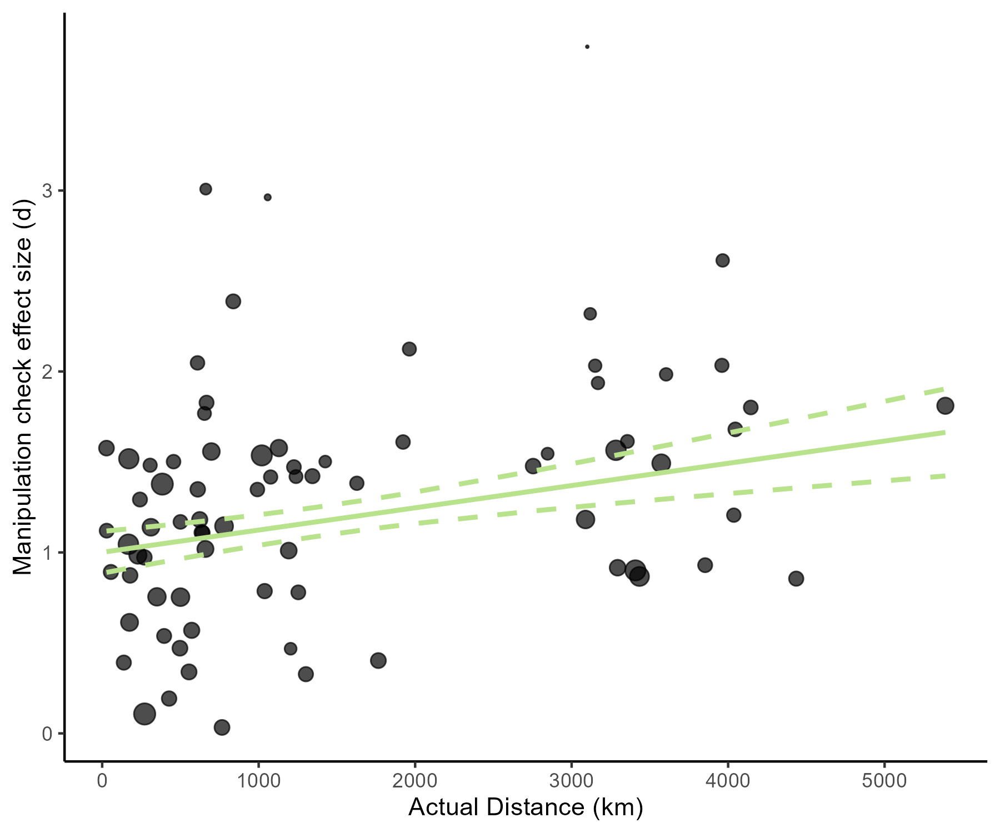

Construal Level International Multilab Replication (CLIMR) Project:
Influence of Actual Distance on the Spatial Distance Effect
================
CLIMR Team
2025-01-07

# Does the actual distance between the cities used in the spatial distance manipulation influence the effect of the manipulation on the BIF?

``` r
lrt_km_spatial
```

    ## Data: data_bif_spatial %>% filter(complete.cases(haversine))
    ## Models:
    ## glmm_spatial_km_base: bif ~ condition + (1 | lab:sub) + (1 | lab) + (1 | item)
    ## glmm_spatial_km_add: bif ~ condition + haversine_rescale + (1 | lab:sub) + (1 | lab) + (1 | item)
    ## glmm_spatial_km_int: bif ~ condition * haversine_rescale + (1 | lab:sub) + (1 | lab) + (1 | item)
    ##                      npar   AIC   BIC logLik deviance  Chisq Df Pr(>Chisq)
    ## glmm_spatial_km_base    5 44981 45024 -22486    44971                     
    ## glmm_spatial_km_add     6 44982 45033 -22485    44970 1.7030  1     0.1919
    ## glmm_spatial_km_int     7 44983 45043 -22485    44969 0.3788  1     0.5383

``` r
summary(glmm_spatial_km_base)
```

    ## Generalized linear mixed model fit by maximum likelihood (Laplace Approximation) ['glmerMod']
    ##  Family: binomial  ( logit )
    ## Formula: bif ~ condition + (1 | lab:sub) + (1 | lab) + (1 | item)
    ##    Data: data_bif_spatial %>% filter(complete.cases(haversine))
    ## 
    ##      AIC      BIC   logLik deviance df.resid 
    ##  44981.2  45024.0 -22485.6  44971.2    38435 
    ## 
    ## Scaled residuals: 
    ##     Min      1Q  Median      3Q     Max 
    ## -3.9151 -0.8235  0.4210  0.6499  2.9669 
    ## 
    ## Random effects:
    ##  Groups  Name        Variance Std.Dev.
    ##  lab:sub (Intercept) 0.77355  0.8795  
    ##  lab     (Intercept) 0.06581  0.2565  
    ##  item    (Intercept) 0.46105  0.6790  
    ## Number of obs: 38440, groups:  lab:sub, 2957; lab, 77; item, 13
    ## 
    ## Fixed effects:
    ##                  Estimate Std. Error z value Pr(>|z|)    
    ## (Intercept)       0.70182    0.19286   3.639 0.000274 ***
    ## conditiondistant  0.04416    0.04031   1.096 0.273221    
    ## ---
    ## Signif. codes:  0 '***' 0.001 '**' 0.01 '*' 0.05 '.' 0.1 ' ' 1
    ## 
    ## Correlation of Fixed Effects:
    ##             (Intr)
    ## condtndstnt -0.104

``` r
summary(glmm_spatial_km_add)
```

    ## Generalized linear mixed model fit by maximum likelihood (Laplace Approximation) ['glmerMod']
    ##  Family: binomial  ( logit )
    ## Formula: bif ~ condition + haversine_rescale + (1 | lab:sub) + (1 | lab) +      (1 | item)
    ##    Data: data_bif_spatial %>% filter(complete.cases(haversine))
    ## Control: glmerControl(optimizer = "bobyqa")
    ## 
    ##      AIC      BIC   logLik deviance df.resid 
    ##  44981.5  45032.9 -22484.8  44969.5    38434 
    ## 
    ## Scaled residuals: 
    ##     Min      1Q  Median      3Q     Max 
    ## -3.9130 -0.8230  0.4211  0.6497  2.9625 
    ## 
    ## Random effects:
    ##  Groups  Name        Variance Std.Dev.
    ##  lab:sub (Intercept) 0.77381  0.8797  
    ##  lab     (Intercept) 0.06304  0.2511  
    ##  item    (Intercept) 0.46100  0.6790  
    ## Number of obs: 38440, groups:  lab:sub, 2957; lab, 77; item, 13
    ## 
    ## Fixed effects:
    ##                    Estimate Std. Error z value Pr(>|z|)    
    ## (Intercept)        0.703149   0.192548   3.652  0.00026 ***
    ## conditiondistant   0.044260   0.040311   1.098  0.27222    
    ## haversine_rescale -0.003359   0.002550  -1.317  0.18773    
    ## ---
    ## Signif. codes:  0 '***' 0.001 '**' 0.01 '*' 0.05 '.' 0.1 ' ' 1
    ## 
    ## Correlation of Fixed Effects:
    ##             (Intr) cndtnd
    ## condtndstnt -0.104       
    ## havrsn_rscl -0.005 -0.002

``` r
summary(glmm_spatial_km_int)
```

    ## Generalized linear mixed model fit by maximum likelihood (Laplace Approximation) ['glmerMod']
    ##  Family: binomial  ( logit )
    ## Formula: bif ~ condition * haversine_rescale + (1 | lab:sub) + (1 | lab) +      (1 | item)
    ##    Data: data_bif_spatial %>% filter(complete.cases(haversine))
    ## Control: glmerControl(optimizer = "bobyqa")
    ## 
    ##      AIC      BIC   logLik deviance df.resid 
    ##  44983.1  45043.0 -22484.6  44969.1    38433 
    ## 
    ## Scaled residuals: 
    ##     Min      1Q  Median      3Q     Max 
    ## -3.9113 -0.8231  0.4208  0.6496  2.9686 
    ## 
    ## Random effects:
    ##  Groups  Name        Variance Std.Dev.
    ##  lab:sub (Intercept) 0.77362  0.8796  
    ##  lab     (Intercept) 0.06306  0.2511  
    ##  item    (Intercept) 0.46109  0.6790  
    ## Number of obs: 38440, groups:  lab:sub, 2957; lab, 77; item, 13
    ## 
    ## Fixed effects:
    ##                                     Estimate Std. Error z value Pr(>|z|)    
    ## (Intercept)                         0.703177   0.192658   3.650 0.000262 ***
    ## conditiondistant                    0.044071   0.040308   1.093 0.274237    
    ## haversine_rescale                  -0.004234   0.002917  -1.451 0.146672    
    ## conditiondistant:haversine_rescale  0.001746   0.002827   0.618 0.536865    
    ## ---
    ## Signif. codes:  0 '***' 0.001 '**' 0.01 '*' 0.05 '.' 0.1 ' ' 1
    ## 
    ## Correlation of Fixed Effects:
    ##             (Intr) cndtnd hvrsn_
    ## condtndstnt -0.104              
    ## havrsn_rscl -0.005  0.002       
    ## cndtndstn:_  0.000 -0.007 -0.486

# Does the actual distance between the cities used in the spatial distance manipulation influence the strength of the spatial distance manipulation?

``` r
meta_spatial_mc_km
```

    ## 
    ## Multivariate Meta-Analysis Model (k = 77; method: REML)
    ## 
    ## Variance Components: none
    ## 
    ## Test for Residual Heterogeneity:
    ## QE(df = 75) = 157.1653, p-val < .0001
    ## 
    ## Test of Moderators (coefficient 2):
    ## QM(df = 1) = 17.6278, p-val < .0001
    ## 
    ## Model Results:
    ## 
    ##            estimate      se     zval    pval   ci.lb   ci.ub      
    ## intrcpt      1.0007  0.0590  16.9737  <.0001  0.8852  1.1163  *** 
    ## haversine    0.0001  0.0000   4.1985  <.0001  0.0001  0.0002  *** 
    ## 
    ## ---
    ## Signif. codes:  0 '***' 0.001 '**' 0.01 '*' 0.05 '.' 0.1 ' ' 1

``` r

```


