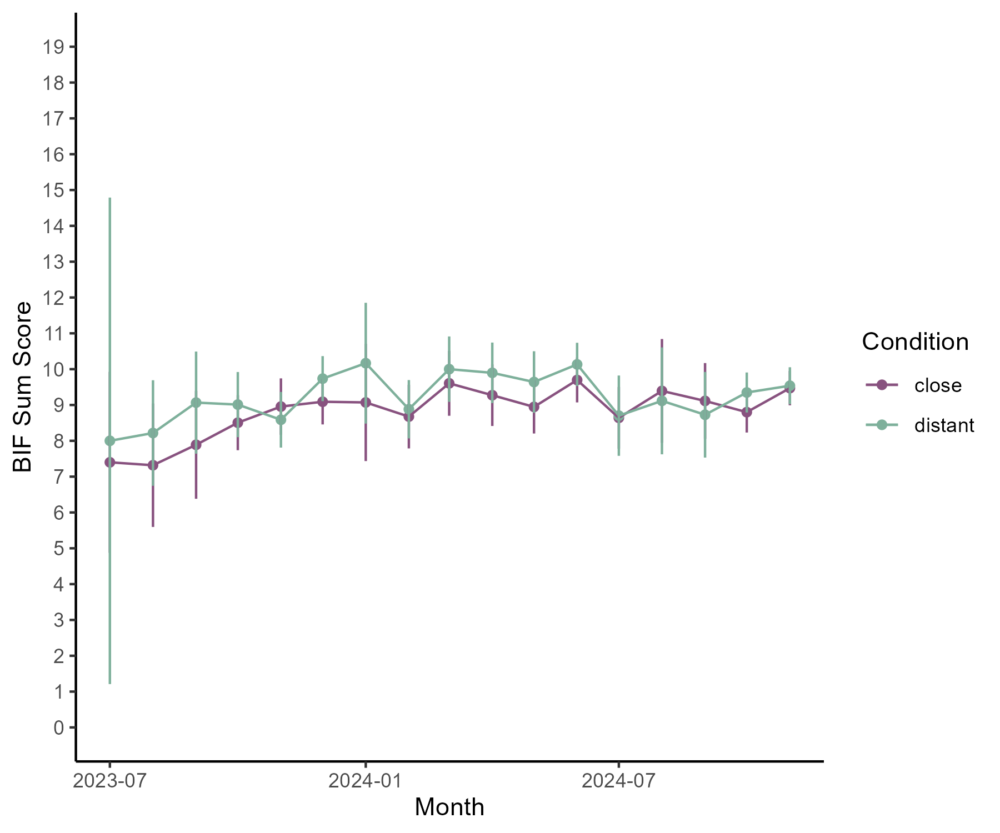
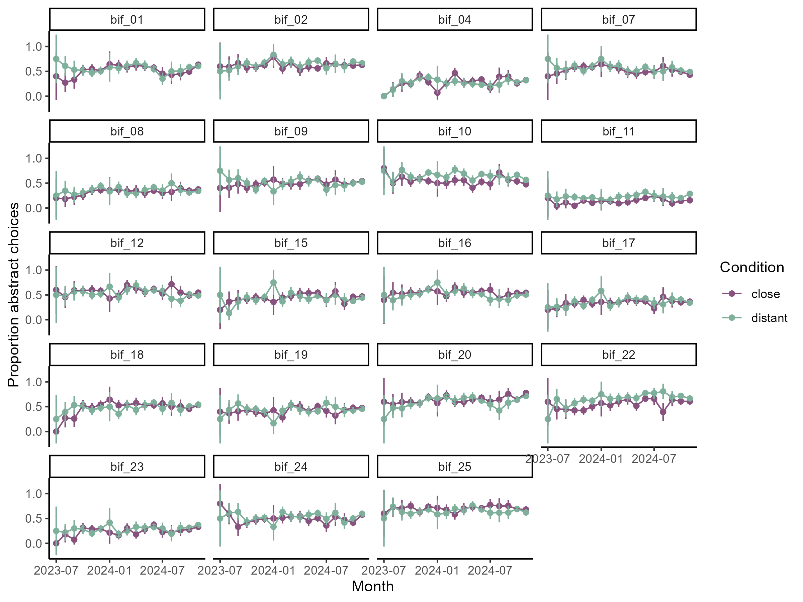

Construal Level International Multilab Replication (CLIMR) Project:
Influence of Actual Time on the Temporal Distance Effect
================
CLIMR Team
2024-12-05

# Does the effect of temporal distance on the BIF vary across the data collection period?

## Sum Score

``` r

```


## Item Level

``` r

```


