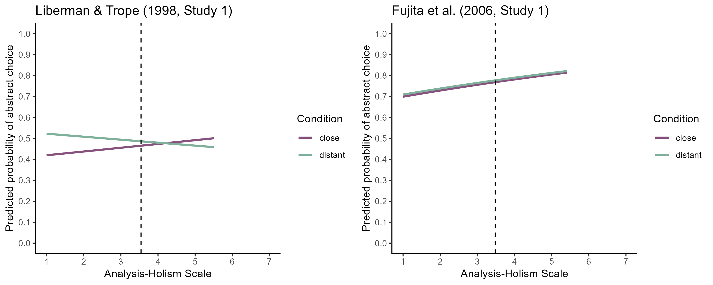

Construal Level International Multilab Replication (CLIMR) Project:
Analysis of Analysis-Holism Scale (AHS)
================
CLIMR Team
2025-05-22

# Analysis-Holism Scale

## Liberman & Trope (1998, Study 1)

``` r
lrt_ahs_temporal
```

    ## Data: data_bif_temporal %>% filter(complete.cases(ahs_mean))
    ## Models:
    ## glmm_temporal_ahs_base: bif ~ condition + (1 | lab:sub) + (1 | lab) + (1 | item)
    ## glmm_temporal_ahs_add: bif ~ condition + ahs_mean + (1 | lab:sub) + (1 | lab) + (1 | item)
    ## glmm_temporal_ahs_int: bif ~ condition * ahs_mean + (1 | lab:sub) + (1 | lab) + (1 | item)
    ##                        npar   AIC   BIC logLik deviance  Chisq Df Pr(>Chisq)  
    ## glmm_temporal_ahs_base    5 68221 68266 -34106    68211                       
    ## glmm_temporal_ahs_add     6 68223 68276 -34105    68211 0.1094  1    0.74086  
    ## glmm_temporal_ahs_int     7 68221 68283 -34103    68207 3.9677  1    0.04638 *
    ## ---
    ## Signif. codes:  0 '***' 0.001 '**' 0.01 '*' 0.05 '.' 0.1 ' ' 1

``` r
summary(glmm_temporal_ahs_base)
```

    ## Generalized linear mixed model fit by maximum likelihood (Laplace Approximation) ['glmerMod']
    ##  Family: binomial  ( logit )
    ## Formula: bif ~ condition + (1 | lab:sub) + (1 | lab) + (1 | item)
    ##    Data: data_bif_temporal %>% filter(complete.cases(ahs_mean))
    ## 
    ##      AIC      BIC   logLik deviance df.resid 
    ##  68221.0  68265.6 -34105.5  68211.0    55232 
    ## 
    ## Scaled residuals: 
    ##     Min      1Q  Median      3Q     Max 
    ## -3.4322 -0.7821 -0.2987  0.7890  4.7979 
    ## 
    ## Random effects:
    ##  Groups  Name        Variance Std.Dev.
    ##  lab:sub (Intercept) 0.7627   0.8733  
    ##  lab     (Intercept) 0.0854   0.2922  
    ##  item    (Intercept) 0.4405   0.6637  
    ## Number of obs: 55237, groups:  lab:sub, 2908; lab, 78; item, 19
    ## 
    ## Fixed effects:
    ##                  Estimate Std. Error z value Pr(>|z|)  
    ## (Intercept)      -0.13985    0.15822  -0.884   0.3768  
    ## conditiondistant  0.08433    0.03769   2.238   0.0252 *
    ## ---
    ## Signif. codes:  0 '***' 0.001 '**' 0.01 '*' 0.05 '.' 0.1 ' ' 1
    ## 
    ## Correlation of Fixed Effects:
    ##             (Intr)
    ## condtndstnt -0.119

``` r
summary(glmm_temporal_ahs_add)
```

    ## Generalized linear mixed model fit by maximum likelihood (Laplace Approximation) ['glmerMod']
    ##  Family: binomial  ( logit )
    ## Formula: bif ~ condition + ahs_mean + (1 | lab:sub) + (1 | lab) + (1 |      item)
    ##    Data: data_bif_temporal %>% filter(complete.cases(ahs_mean))
    ## 
    ##      AIC      BIC   logLik deviance df.resid 
    ##  68222.9  68276.4 -34105.4  68210.9    55231 
    ## 
    ## Scaled residuals: 
    ##     Min      1Q  Median      3Q     Max 
    ## -3.4286 -0.7820 -0.2986  0.7892  4.7956 
    ## 
    ## Random effects:
    ##  Groups  Name        Variance Std.Dev.
    ##  lab:sub (Intercept) 0.76260  0.8733  
    ##  lab     (Intercept) 0.08578  0.2929  
    ##  item    (Intercept) 0.44052  0.6637  
    ## Number of obs: 55237, groups:  lab:sub, 2908; lab, 78; item, 19
    ## 
    ## Fixed effects:
    ##                  Estimate Std. Error z value Pr(>|z|)  
    ## (Intercept)      -0.13990    0.15829  -0.884   0.3768  
    ## conditiondistant  0.08422    0.03769   2.235   0.0254 *
    ## ahs_mean          0.01100    0.03322   0.331   0.7405  
    ## ---
    ## Signif. codes:  0 '***' 0.001 '**' 0.01 '*' 0.05 '.' 0.1 ' ' 1
    ## 
    ## Correlation of Fixed Effects:
    ##             (Intr) cndtnd
    ## condtndstnt -0.119       
    ## ahs_mean    -0.001 -0.009

``` r
summary(glmm_temporal_ahs_int)
```

    ## Generalized linear mixed model fit by maximum likelihood (Laplace Approximation) ['glmerMod']
    ##  Family: binomial  ( logit )
    ## Formula: bif ~ condition * ahs_mean + (1 | lab:sub) + (1 | lab) + (1 |      item)
    ##    Data: data_bif_temporal %>% filter(complete.cases(ahs_mean))
    ## 
    ##      AIC      BIC   logLik deviance df.resid 
    ##  68220.9  68283.4 -34103.5  68206.9    55230 
    ## 
    ## Scaled residuals: 
    ##     Min      1Q  Median      3Q     Max 
    ## -3.4516 -0.7825 -0.2985  0.7889  4.7838 
    ## 
    ## Random effects:
    ##  Groups  Name        Variance Std.Dev.
    ##  lab:sub (Intercept) 0.76107  0.8724  
    ##  lab     (Intercept) 0.08608  0.2934  
    ##  item    (Intercept) 0.44052  0.6637  
    ## Number of obs: 55237, groups:  lab:sub, 2908; lab, 78; item, 19
    ## 
    ## Fixed effects:
    ##                           Estimate Std. Error z value Pr(>|z|)  
    ## (Intercept)               -0.13942    0.15821  -0.881   0.3782  
    ## conditiondistant           0.08415    0.03766   2.234   0.0255 *
    ## ahs_mean                   0.07262    0.04533   1.602   0.1091  
    ## conditiondistant:ahs_mean -0.12954    0.06492  -1.996   0.0460 *
    ## ---
    ## Signif. codes:  0 '***' 0.001 '**' 0.01 '*' 0.05 '.' 0.1 ' ' 1
    ## 
    ## Correlation of Fixed Effects:
    ##             (Intr) cndtnd ahs_mn
    ## condtndstnt -0.118              
    ## ahs_mean     0.000 -0.007       
    ## cndtndstn:_ -0.001  0.001 -0.681

## Fujita et al. (2006, Study 1)

``` r
lrt_ahs_spatial
```

    ## Data: data_bif_spatial %>% filter(complete.cases(ahs_mean))
    ## Models:
    ## glmm_spatial_ahs_base: bif ~ condition + (1 | lab:sub) + (1 | lab) + (1 | item)
    ## glmm_spatial_ahs_add: bif ~ condition + ahs_mean + (1 | lab:sub) + (1 | lab) + (1 | item)
    ## glmm_spatial_ahs_int: bif ~ condition * ahs_mean + (1 | lab:sub) + (1 | lab) + (1 | item)
    ##                       npar   AIC   BIC logLik deviance   Chisq Df Pr(>Chisq)    
    ## glmm_spatial_ahs_base    5 44865 44907 -22427    44855                          
    ## glmm_spatial_ahs_add     6 44850 44901 -22419    44838 16.6748  1  4.437e-05 ***
    ## glmm_spatial_ahs_int     7 44849 44909 -22417    44835  3.2619  1    0.07091 .  
    ## ---
    ## Signif. codes:  0 '***' 0.001 '**' 0.01 '*' 0.05 '.' 0.1 ' ' 1

``` r
summary(glmm_spatial_ahs_base)
```

    ## Generalized linear mixed model fit by maximum likelihood (Laplace Approximation) ['glmerMod']
    ##  Family: binomial  ( logit )
    ## Formula: bif ~ condition + (1 | lab:sub) + (1 | lab) + (1 | item)
    ##    Data: data_bif_spatial %>% filter(complete.cases(ahs_mean))
    ## 
    ##      AIC      BIC   logLik deviance df.resid 
    ##  44864.7  44907.5 -22427.4  44854.7    38331 
    ## 
    ## Scaled residuals: 
    ##     Min      1Q  Median      3Q     Max 
    ## -3.8833 -0.8241  0.4214  0.6499  2.9773 
    ## 
    ## Random effects:
    ##  Groups  Name        Variance Std.Dev.
    ##  lab:sub (Intercept) 0.7722   0.8788  
    ##  lab     (Intercept) 0.0628   0.2506  
    ##  item    (Intercept) 0.4620   0.6797  
    ## Number of obs: 38336, groups:  lab:sub, 2949; lab, 78; item, 13
    ## 
    ## Fixed effects:
    ##                  Estimate Std. Error z value Pr(>|z|)    
    ## (Intercept)       0.70275    0.19313   3.639 0.000274 ***
    ## conditiondistant  0.04458    0.04034   1.105 0.269131    
    ## ---
    ## Signif. codes:  0 '***' 0.001 '**' 0.01 '*' 0.05 '.' 0.1 ' ' 1
    ## 
    ## Correlation of Fixed Effects:
    ##             (Intr)
    ## condtndstnt -0.104

``` r
summary(glmm_spatial_ahs_add)
```

    ## Generalized linear mixed model fit by maximum likelihood (Laplace Approximation) ['glmerMod']
    ##  Family: binomial  ( logit )
    ## Formula: bif ~ condition + ahs_mean + (1 | lab:sub) + (1 | lab) + (1 |      item)
    ##    Data: data_bif_spatial %>% filter(complete.cases(ahs_mean))
    ## 
    ##      AIC      BIC   logLik deviance df.resid 
    ##  44850.0  44901.4 -22419.0  44838.0    38330 
    ## 
    ## Scaled residuals: 
    ##     Min      1Q  Median      3Q     Max 
    ## -3.9836 -0.8231  0.4212  0.6513  3.0594 
    ## 
    ## Random effects:
    ##  Groups  Name        Variance Std.Dev.
    ##  lab:sub (Intercept) 0.76535  0.8748  
    ##  lab     (Intercept) 0.06363  0.2523  
    ##  item    (Intercept) 0.46198  0.6797  
    ## Number of obs: 38336, groups:  lab:sub, 2949; lab, 78; item, 13
    ## 
    ## Fixed effects:
    ##                  Estimate Std. Error z value Pr(>|z|)    
    ## (Intercept)       0.69960    0.19311   3.623 0.000292 ***
    ## conditiondistant  0.04859    0.04024   1.207 0.227254    
    ## ahs_mean          0.14369    0.03504   4.101 4.11e-05 ***
    ## ---
    ## Signif. codes:  0 '***' 0.001 '**' 0.01 '*' 0.05 '.' 0.1 ' ' 1
    ## 
    ## Correlation of Fixed Effects:
    ##             (Intr) cndtnd
    ## condtndstnt -0.104       
    ## ahs_mean    -0.003  0.025

``` r
summary(glmm_spatial_ahs_int)
```

    ## Generalized linear mixed model fit by maximum likelihood (Laplace Approximation) ['glmerMod']
    ##  Family: binomial  ( logit )
    ## Formula: bif ~ condition * ahs_mean + (1 | lab:sub) + (1 | lab) + (1 |      item)
    ##    Data: data_bif_spatial %>% filter(complete.cases(ahs_mean))
    ## Control: glmerControl(optimizer = "bobyqa")
    ## 
    ##      AIC      BIC   logLik deviance df.resid 
    ##  44848.8  44908.7 -22417.4  44834.8    38329 
    ## 
    ## Scaled residuals: 
    ##     Min      1Q  Median      3Q     Max 
    ## -3.9887 -0.8240  0.4210  0.6508  3.0114 
    ## 
    ## Random effects:
    ##  Groups  Name        Variance Std.Dev.
    ##  lab:sub (Intercept) 0.76397  0.8741  
    ##  lab     (Intercept) 0.06417  0.2533  
    ##  item    (Intercept) 0.46203  0.6797  
    ## Number of obs: 38336, groups:  lab:sub, 2949; lab, 78; item, 13
    ## 
    ## Fixed effects:
    ##                           Estimate Std. Error z value Pr(>|z|)    
    ## (Intercept)                0.69898    0.19286   3.624  0.00029 ***
    ## conditiondistant           0.04795    0.04021   1.192  0.23308    
    ## ahs_mean                   0.20285    0.04787   4.237 2.26e-05 ***
    ## conditiondistant:ahs_mean -0.12438    0.06859  -1.813  0.06978 .  
    ## ---
    ## Signif. codes:  0 '***' 0.001 '**' 0.01 '*' 0.05 '.' 0.1 ' ' 1
    ## 
    ## Correlation of Fixed Effects:
    ##             (Intr) cndtnd ahs_mn
    ## condtndstnt -0.104              
    ## ahs_mean    -0.003  0.012       
    ## cndtndstn:_  0.001  0.008 -0.682

## Social Distance (Paradigmatic Replication)

``` r
lrt_ahs_social
```

    ## Data: data_bif_social %>% filter(complete.cases(ahs_mean))
    ## Models:
    ## glmm_social_ahs_base: bif ~ condition + (1 | lab:sub) + (1 | lab) + (1 | item)
    ## glmm_social_ahs_add: bif ~ condition + ahs_mean + (1 | lab:sub) + (1 | lab) + (1 | item)
    ## glmm_social_ahs_int: bif ~ condition * ahs_mean + (1 | lab:sub) + (1 | lab) + (1 | item)
    ##                      npar   AIC   BIC logLik deviance  Chisq Df Pr(>Chisq)  
    ## glmm_social_ahs_base    5 87891 87936 -43940    87881                       
    ## glmm_social_ahs_add     6 87889 87944 -43938    87877 3.5673  1    0.05893 .
    ## glmm_social_ahs_int     7 87888 87953 -43937    87874 2.4651  1    0.11640  
    ## ---
    ## Signif. codes:  0 '***' 0.001 '**' 0.01 '*' 0.05 '.' 0.1 ' ' 1

``` r
summary(glmm_social_ahs_base)
```

    ## Generalized linear mixed model fit by maximum likelihood (Laplace Approximation) ['glmerMod']
    ##  Family: binomial  ( logit )
    ## Formula: bif ~ condition + (1 | lab:sub) + (1 | lab) + (1 | item)
    ##    Data: data_bif_social %>% filter(complete.cases(ahs_mean))
    ## 
    ##      AIC      BIC   logLik deviance df.resid 
    ##  87890.5  87936.5 -43940.3  87880.5    72271 
    ## 
    ## Scaled residuals: 
    ##     Min      1Q  Median      3Q     Max 
    ## -3.1900 -0.7246 -0.4331  0.8739  5.3134 
    ## 
    ## Random effects:
    ##  Groups  Name        Variance Std.Dev.
    ##  lab:sub (Intercept) 0.85440  0.9243  
    ##  lab     (Intercept) 0.04728  0.2174  
    ##  item    (Intercept) 0.21207  0.4605  
    ## Number of obs: 72276, groups:  lab:sub, 2892; lab, 78; item, 25
    ## 
    ## Fixed effects:
    ##                  Estimate Std. Error z value Pr(>|z|)    
    ## (Intercept)      -0.38143    0.09936  -3.839 0.000124 ***
    ## conditiondistant -0.27608    0.03844  -7.182 6.85e-13 ***
    ## ---
    ## Signif. codes:  0 '***' 0.001 '**' 0.01 '*' 0.05 '.' 0.1 ' ' 1
    ## 
    ## Correlation of Fixed Effects:
    ##             (Intr)
    ## condtndstnt -0.193

``` r
summary(glmm_social_ahs_add)
```

    ## Generalized linear mixed model fit by maximum likelihood (Laplace Approximation) ['glmerMod']
    ##  Family: binomial  ( logit )
    ## Formula: bif ~ condition + ahs_mean + (1 | lab:sub) + (1 | lab) + (1 |      item)
    ##    Data: data_bif_social %>% filter(complete.cases(ahs_mean))
    ## 
    ##      AIC      BIC   logLik deviance df.resid 
    ##  87889.0  87944.1 -43938.5  87877.0    72270 
    ## 
    ## Scaled residuals: 
    ##     Min      1Q  Median      3Q     Max 
    ## -3.2032 -0.7245 -0.4329  0.8741  5.2912 
    ## 
    ## Random effects:
    ##  Groups  Name        Variance Std.Dev.
    ##  lab:sub (Intercept) 0.85272  0.9234  
    ##  lab     (Intercept) 0.04854  0.2203  
    ##  item    (Intercept) 0.21209  0.4605  
    ## Number of obs: 72276, groups:  lab:sub, 2892; lab, 78; item, 25
    ## 
    ## Fixed effects:
    ##                  Estimate Std. Error z value Pr(>|z|)    
    ## (Intercept)      -0.38266    0.09944  -3.848 0.000119 ***
    ## conditiondistant -0.27530    0.03841  -7.167 7.65e-13 ***
    ## ahs_mean          0.06293    0.03327   1.892 0.058537 .  
    ## ---
    ## Signif. codes:  0 '***' 0.001 '**' 0.01 '*' 0.05 '.' 0.1 ' ' 1
    ## 
    ## Correlation of Fixed Effects:
    ##             (Intr) cndtnd
    ## condtndstnt -0.192       
    ## ahs_mean    -0.007  0.010

``` r
summary(glmm_social_ahs_int)
```

    ## Generalized linear mixed model fit by maximum likelihood (Laplace Approximation) ['glmerMod']
    ##  Family: binomial  ( logit )
    ## Formula: bif ~ condition * ahs_mean + (1 | lab:sub) + (1 | lab) + (1 |      item)
    ##    Data: data_bif_social %>% filter(complete.cases(ahs_mean))
    ## Control: glmerControl(optimizer = "bobyqa")
    ## 
    ##      AIC      BIC   logLik deviance df.resid 
    ##  87888.5  87952.8 -43937.2  87874.5    72269 
    ## 
    ## Scaled residuals: 
    ##     Min      1Q  Median      3Q     Max 
    ## -3.2120 -0.7247 -0.4330  0.8742  5.2994 
    ## 
    ## Random effects:
    ##  Groups  Name        Variance Std.Dev.
    ##  lab:sub (Intercept) 0.85194  0.9230  
    ##  lab     (Intercept) 0.04836  0.2199  
    ##  item    (Intercept) 0.21208  0.4605  
    ## Number of obs: 72276, groups:  lab:sub, 2892; lab, 78; item, 25
    ## 
    ## Fixed effects:
    ##                           Estimate Std. Error z value Pr(>|z|)    
    ## (Intercept)               -0.38290    0.09943  -3.851 0.000118 ***
    ## conditiondistant          -0.27526    0.03839  -7.169 7.54e-13 ***
    ## ahs_mean                   0.11398    0.04647   2.453 0.014175 *  
    ## conditiondistant:ahs_mean -0.10212    0.06493  -1.573 0.115774    
    ## ---
    ## Signif. codes:  0 '***' 0.001 '**' 0.01 '*' 0.05 '.' 0.1 ' ' 1
    ## 
    ## Correlation of Fixed Effects:
    ##             (Intr) cndtnd ahs_mn
    ## condtndstnt -0.192              
    ## ahs_mean    -0.006  0.008       
    ## cndtndstn:_  0.002  0.000 -0.698

## Likelihood Distance (Paradigmatic Replication)

``` r
lrt_ahs_likelihood
```

    ## Data: data_bif_likelihood %>% filter(complete.cases(ahs_mean))
    ## Models:
    ## glmm_likelihood_ahs_base: bif ~ condition + (1 | lab:sub) + (1 | lab) + (1 | item)
    ## glmm_likelihood_ahs_add: bif ~ condition + ahs_mean + (1 | lab:sub) + (1 | lab) + (1 | item)
    ## glmm_likelihood_ahs_int: bif ~ condition * ahs_mean + (1 | lab:sub) + (1 | lab) + (1 | item)
    ##                          npar   AIC   BIC logLik deviance  Chisq Df Pr(>Chisq)
    ## glmm_likelihood_ahs_base    5 32483 32524 -16237    32473                     
    ## glmm_likelihood_ahs_add     6 32483 32532 -16236    32471 2.2659  1     0.1322
    ## glmm_likelihood_ahs_int     7 32485 32542 -16236    32471 0.0088  1     0.9253

``` r
summary(glmm_likelihood_ahs_base)
```

    ## Generalized linear mixed model fit by maximum likelihood (Laplace Approximation) ['glmerMod']
    ##  Family: binomial  ( logit )
    ## Formula: bif ~ condition + (1 | lab:sub) + (1 | lab) + (1 | item)
    ##    Data: data_bif_likelihood %>% filter(complete.cases(ahs_mean))
    ## 
    ##      AIC      BIC   logLik deviance df.resid 
    ##  32483.2  32524.1 -16236.6  32473.2    26139 
    ## 
    ## Scaled residuals: 
    ##     Min      1Q  Median      3Q     Max 
    ## -2.8290 -0.7990  0.3328  0.7635  3.0332 
    ## 
    ## Random effects:
    ##  Groups  Name        Variance Std.Dev.
    ##  lab:sub (Intercept) 0.67096  0.8191  
    ##  lab     (Intercept) 0.04007  0.2002  
    ##  item    (Intercept) 0.62145  0.7883  
    ## Number of obs: 26144, groups:  lab:sub, 2905; lab, 77; item, 9
    ## 
    ## Fixed effects:
    ##                   Estimate Std. Error z value Pr(>|z|)
    ## (Intercept)      -0.002008   0.265301  -0.008    0.994
    ## conditiondistant  0.048543   0.041236   1.177    0.239
    ## 
    ## Correlation of Fixed Effects:
    ##             (Intr)
    ## condtndstnt -0.077

``` r
summary(glmm_likelihood_ahs_add)
```

    ## Generalized linear mixed model fit by maximum likelihood (Laplace Approximation) ['glmerMod']
    ##  Family: binomial  ( logit )
    ## Formula: bif ~ condition + ahs_mean + (1 | lab:sub) + (1 | lab) + (1 |      item)
    ##    Data: data_bif_likelihood %>% filter(complete.cases(ahs_mean))
    ## 
    ##      AIC      BIC   logLik deviance df.resid 
    ##  32483.0  32532.0 -16235.5  32471.0    26138 
    ## 
    ## Scaled residuals: 
    ##     Min      1Q  Median      3Q     Max 
    ## -2.8202 -0.7980  0.3322  0.7652  3.0248 
    ## 
    ## Random effects:
    ##  Groups  Name        Variance Std.Dev.
    ##  lab:sub (Intercept) 0.67010  0.8186  
    ##  lab     (Intercept) 0.04006  0.2001  
    ##  item    (Intercept) 0.62145  0.7883  
    ## Number of obs: 26144, groups:  lab:sub, 2905; lab, 77; item, 9
    ## 
    ## Fixed effects:
    ##                   Estimate Std. Error z value Pr(>|z|)
    ## (Intercept)      -0.003353   0.265315  -0.013    0.990
    ## conditiondistant  0.050382   0.041240   1.222    0.222
    ## ahs_mean          0.054606   0.036161   1.510    0.131
    ## 
    ## Correlation of Fixed Effects:
    ##             (Intr) cndtnd
    ## condtndstnt -0.077       
    ## ahs_mean    -0.003  0.030

``` r
summary(glmm_likelihood_ahs_int)
```

    ## Generalized linear mixed model fit by maximum likelihood (Laplace Approximation) ['glmerMod']
    ##  Family: binomial  ( logit )
    ## Formula: bif ~ condition * ahs_mean + (1 | lab:sub) + (1 | lab) + (1 |      item)
    ##    Data: data_bif_likelihood %>% filter(complete.cases(ahs_mean))
    ## 
    ##      AIC      BIC   logLik deviance df.resid 
    ##  32485.0  32542.2 -16235.5  32471.0    26137 
    ## 
    ## Scaled residuals: 
    ##     Min      1Q  Median      3Q     Max 
    ## -2.8183 -0.7980  0.3323  0.7651  3.0251 
    ## 
    ## Random effects:
    ##  Groups  Name        Variance Std.Dev.
    ##  lab:sub (Intercept) 0.67009  0.8186  
    ##  lab     (Intercept) 0.04006  0.2002  
    ##  item    (Intercept) 0.62139  0.7883  
    ## Number of obs: 26144, groups:  lab:sub, 2905; lab, 77; item, 9
    ## 
    ## Fixed effects:
    ##                            Estimate Std. Error z value Pr(>|z|)
    ## (Intercept)               -0.003279   0.265742  -0.012    0.990
    ## conditiondistant           0.050382   0.041241   1.222    0.222
    ## ahs_mean                   0.051463   0.049235   1.045    0.296
    ## conditiondistant:ahs_mean  0.006714   0.071279   0.094    0.925
    ## 
    ## Correlation of Fixed Effects:
    ##             (Intr) cndtnd ahs_mn
    ## condtndstnt -0.077              
    ## ahs_mean    -0.004  0.021       
    ## cndtndstn:_  0.003  0.001 -0.679

# Visualization of Predicted Probabilities

``` r

```


