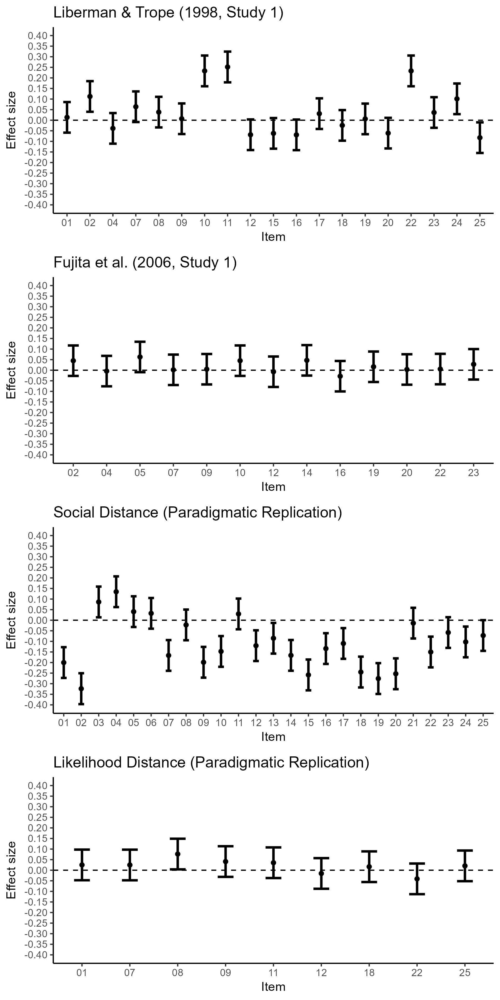
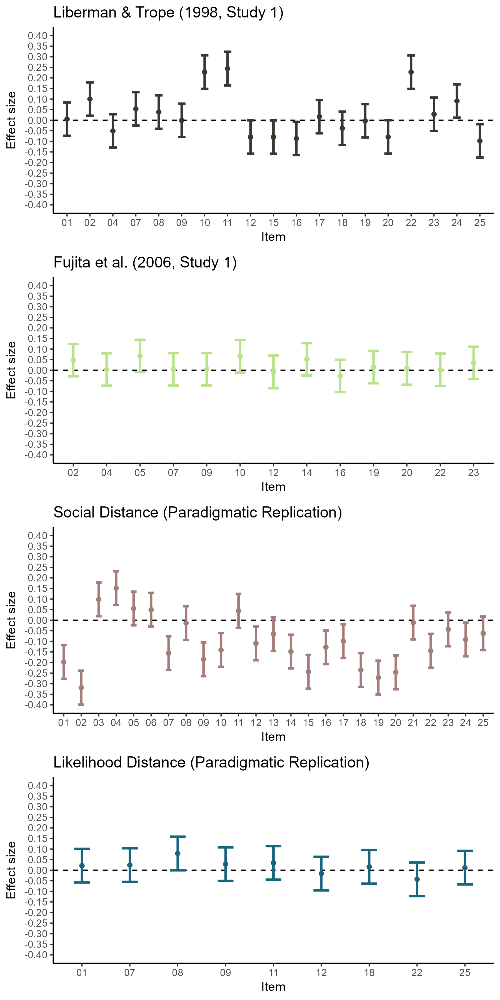

Construal Level International Multilab Replication (CLIMR) Project:
Exploration of Item-Level Effects on the BIF
================
CLIMR Team
2025-01-07

# Overview

## Effects calculated from raw data

``` r

```


## Effects calculated meta-analytically

``` r

```


# Liberman & Trope (1998, Study 1)

## Effects calculated from raw data

``` r
item_effects_temporal
```

    ## # A tibble: 19 × 4
    ##    item          d    ci_lb    ci_ub
    ##    <chr>     <dbl>    <dbl>    <dbl>
    ##  1 bif_01  0.0135  -0.0588   0.0858 
    ##  2 bif_02  0.112    0.0399   0.185  
    ##  3 bif_04 -0.0385  -0.111    0.0338 
    ##  4 bif_07  0.0637  -0.00865  0.136  
    ##  5 bif_08  0.0383  -0.0341   0.111  
    ##  6 bif_09  0.00693 -0.0654   0.0793 
    ##  7 bif_10  0.233    0.160    0.306  
    ##  8 bif_11  0.252    0.179    0.324  
    ##  9 bif_12 -0.0687  -0.141    0.00371
    ## 10 bif_15 -0.0622  -0.135    0.0102 
    ## 11 bif_16 -0.0692  -0.142    0.00313
    ## 12 bif_17  0.0310  -0.0413   0.103  
    ## 13 bif_18 -0.0245  -0.0968   0.0479 
    ## 14 bif_19  0.00621 -0.0661   0.0786 
    ## 15 bif_20 -0.0611  -0.133    0.0113 
    ## 16 bif_22  0.233    0.160    0.306  
    ## 17 bif_23  0.0365  -0.0359   0.109  
    ## 18 bif_24  0.101    0.0287   0.173  
    ## 19 bif_25 -0.0825  -0.155   -0.0101

## Meta-Analytic Approach

``` r
meta_temporal_bif_item
```

    ## 
    ## Multivariate Meta-Analysis Model (k = 1493; method: REML)
    ## 
    ## Variance Components:
    ## 
    ##             estim    sqrt  nlvls  fixed        factor 
    ## sigma^2    0.0170  0.1305     79     no  lab_modality 
    ## 
    ## Test for Residual Heterogeneity:
    ## QE(df = 1474) = 1503.4545, p-val = 0.2908
    ## 
    ## Test of Moderators (coefficients 1:19):
    ## QM(df = 19) = 154.1068, p-val < .0001
    ## 
    ## Model Results:
    ## 
    ##             estimate      se     zval    pval    ci.lb    ci.ub      
    ## itembif_01    0.0051  0.0402   0.1268  0.8991  -0.0736   0.0838      
    ## itembif_02    0.1000  0.0403   2.4847  0.0130   0.0211   0.1789    * 
    ## itembif_04   -0.0505  0.0402  -1.2560  0.2091  -0.1293   0.0283      
    ## itembif_07    0.0538  0.0401   1.3398  0.1803  -0.0249   0.1325      
    ## itembif_08    0.0385  0.0404   0.9548  0.3397  -0.0406   0.1176      
    ## itembif_09   -0.0007  0.0403  -0.0182  0.9854  -0.0797   0.0783      
    ## itembif_10    0.2274  0.0404   5.6212  <.0001   0.1481   0.3066  *** 
    ## itembif_11    0.2441  0.0406   6.0087  <.0001   0.1645   0.3237  *** 
    ## itembif_12   -0.0793  0.0402  -1.9739  0.0484  -0.1580  -0.0006    * 
    ## itembif_15   -0.0795  0.0402  -1.9802  0.0477  -0.1582  -0.0008    * 
    ## itembif_16   -0.0863  0.0402  -2.1502  0.0315  -0.1650  -0.0076    * 
    ## itembif_17    0.0168  0.0402   0.4175  0.6763  -0.0619   0.0955      
    ## itembif_18   -0.0380  0.0402  -0.9470  0.3436  -0.1168   0.0407      
    ## itembif_19   -0.0026  0.0401  -0.0652  0.9480  -0.0813   0.0761      
    ## itembif_20   -0.0789  0.0401  -1.9649  0.0494  -0.1576  -0.0002    * 
    ## itembif_22    0.2272  0.0404   5.6247  <.0001   0.1480   0.3063  *** 
    ## itembif_23    0.0280  0.0402   0.6951  0.4870  -0.0509   0.1068      
    ## itembif_24    0.0906  0.0402   2.2562  0.0241   0.0119   0.1693    * 
    ## itembif_25   -0.0975  0.0402  -2.4289  0.0151  -0.1763  -0.0188    * 
    ## 
    ## ---
    ## Signif. codes:  0 '***' 0.001 '**' 0.01 '*' 0.05 '.' 0.1 ' ' 1

# Fujita et al. (2006, Study 1)

## Effects calculated from raw data

``` r
item_effects_spatial
```

    ## # A tibble: 13 × 4
    ##    item          d    ci_lb  ci_ub
    ##    <chr>     <dbl>    <dbl>  <dbl>
    ##  1 bif_02  0.0453  -0.0266  0.117 
    ##  2 bif_04 -0.00498 -0.0769  0.0670
    ##  3 bif_05  0.0626  -0.00935 0.135 
    ##  4 bif_07  0.00190 -0.0700  0.0738
    ##  5 bif_09  0.00469 -0.0673  0.0766
    ##  6 bif_10  0.0450  -0.0269  0.117 
    ##  7 bif_12 -0.00723 -0.0792  0.0647
    ##  8 bif_14  0.0467  -0.0253  0.119 
    ##  9 bif_16 -0.0283  -0.100   0.0436
    ## 10 bif_19  0.0163  -0.0557  0.0882
    ## 11 bif_20  0.00350 -0.0684  0.0754
    ## 12 bif_22  0.00545 -0.0665  0.0774
    ## 13 bif_23  0.0279  -0.0441  0.0998

## Meta-Analytic Approach

``` r
meta_spatial_bif_item
```

    ## 
    ## Multivariate Meta-Analysis Model (k = 1018; method: REML)
    ## 
    ## Variance Components:
    ## 
    ##             estim    sqrt  nlvls  fixed        factor 
    ## sigma^2    0.0107  0.1035     79     no  lab_modality 
    ## 
    ## Test for Residual Heterogeneity:
    ## QE(df = 1005) = 1033.1191, p-val = 0.2623
    ## 
    ## Test of Moderators (coefficients 1:13):
    ## QM(df = 13) = 9.3174, p-val = 0.7486
    ## 
    ## Model Results:
    ## 
    ##             estimate      se     zval    pval    ci.lb   ci.ub    
    ## itembif_02    0.0474  0.0391   1.2122  0.2254  -0.0292  0.1240    
    ## itembif_04    0.0033  0.0390   0.0847  0.9325  -0.0731  0.0797    
    ## itembif_05    0.0676  0.0390   1.7337  0.0830  -0.0088  0.1440  . 
    ## itembif_07    0.0044  0.0390   0.1126  0.9104  -0.0720  0.0808    
    ## itembif_09    0.0047  0.0390   0.1192  0.9051  -0.0718  0.0811    
    ## itembif_10    0.0656  0.0392   1.6706  0.0948  -0.0114  0.1425  . 
    ## itembif_12   -0.0079  0.0394  -0.2013  0.8405  -0.0852  0.0693    
    ## itembif_14    0.0515  0.0389   1.3232  0.1858  -0.0248  0.1277    
    ## itembif_16   -0.0271  0.0390  -0.6948  0.4872  -0.1036  0.0494    
    ## itembif_19    0.0149  0.0391   0.3806  0.7035  -0.0617  0.0915    
    ## itembif_20    0.0090  0.0395   0.2268  0.8206  -0.0684  0.0864    
    ## itembif_22    0.0022  0.0391   0.0557  0.9556  -0.0745  0.0789    
    ## itembif_23    0.0346  0.0390   0.8872  0.3750  -0.0418  0.1110    
    ## 
    ## ---
    ## Signif. codes:  0 '***' 0.001 '**' 0.01 '*' 0.05 '.' 0.1 ' ' 1

# Social Distance (Paradigmatic Replication)

## Effects calculated from raw data

``` r
item_effects_social
```

    ## # A tibble: 25 × 4
    ##    item         d   ci_lb   ci_ub
    ##    <chr>    <dbl>   <dbl>   <dbl>
    ##  1 bif_01 -0.200  -0.273  -0.127 
    ##  2 bif_02 -0.324  -0.397  -0.251 
    ##  3 bif_03  0.0863  0.0137  0.159 
    ##  4 bif_04  0.135   0.0619  0.207 
    ##  5 bif_05  0.0405 -0.0321  0.113 
    ##  6 bif_06  0.0325 -0.0401  0.105 
    ##  7 bif_07 -0.166  -0.239  -0.0938
    ##  8 bif_08 -0.0222 -0.0948  0.0503
    ##  9 bif_09 -0.199  -0.271  -0.126 
    ## 10 bif_10 -0.148  -0.220  -0.0749
    ## # ℹ 15 more rows

## Meta-Analytic Approach

``` r
meta_social_bif_item
```

    ## 
    ## Multivariate Meta-Analysis Model (k = 1965; method: REML)
    ## 
    ## Variance Components:
    ## 
    ##             estim    sqrt  nlvls  fixed        factor 
    ## sigma^2    0.0190  0.1379     79     no  lab_modality 
    ## 
    ## Test for Residual Heterogeneity:
    ## QE(df = 1940) = 2278.0755, p-val < .0001
    ## 
    ## Test of Moderators (coefficients 1:25):
    ## QM(df = 25) = 285.1660, p-val < .0001
    ## 
    ## Model Results:
    ## 
    ##             estimate      se     zval    pval    ci.lb    ci.ub      
    ## itembif_01   -0.1973  0.0407  -4.8440  <.0001  -0.2771  -0.1175  *** 
    ## itembif_02   -0.3188  0.0409  -7.7922  <.0001  -0.3990  -0.2386  *** 
    ## itembif_03    0.0984  0.0407   2.4207  0.0155   0.0187   0.1781    * 
    ## itembif_04    0.1516  0.0407   3.7275  0.0002   0.0719   0.2312  *** 
    ## itembif_05    0.0555  0.0406   1.3648  0.1723  -0.0242   0.1351      
    ## itembif_06    0.0498  0.0406   1.2260  0.2202  -0.0298   0.1294      
    ## itembif_07   -0.1557  0.0407  -3.8245  0.0001  -0.2355  -0.0759  *** 
    ## itembif_08   -0.0136  0.0406  -0.3338  0.7385  -0.0932   0.0661      
    ## itembif_09   -0.1847  0.0407  -4.5340  <.0001  -0.2645  -0.1048  *** 
    ## itembif_10   -0.1405  0.0407  -3.4500  0.0006  -0.2204  -0.0607  *** 
    ## itembif_11    0.0442  0.0410   1.0776  0.2812  -0.0362   0.1245      
    ## itembif_12   -0.1096  0.0407  -2.6949  0.0070  -0.1893  -0.0299   ** 
    ## itembif_13   -0.0658  0.0406  -1.6196  0.1053  -0.1455   0.0138      
    ## itembif_14   -0.1481  0.0406  -3.6463  0.0003  -0.2277  -0.0685  *** 
    ## itembif_15   -0.2435  0.0408  -5.9725  <.0001  -0.3234  -0.1636  *** 
    ## itembif_16   -0.1279  0.0406  -3.1470  0.0016  -0.2075  -0.0482   ** 
    ## itembif_17   -0.0991  0.0407  -2.4323  0.0150  -0.1790  -0.0192    * 
    ## itembif_18   -0.2357  0.0408  -5.7809  <.0001  -0.3157  -0.1558  *** 
    ## itembif_19   -0.2712  0.0409  -6.6393  <.0001  -0.3513  -0.1912  *** 
    ## itembif_20   -0.2463  0.0408  -6.0391  <.0001  -0.3263  -0.1664  *** 
    ## itembif_21   -0.0114  0.0407  -0.2808  0.7789  -0.0911   0.0683      
    ## itembif_22   -0.1445  0.0408  -3.5400  0.0004  -0.2245  -0.0645  *** 
    ## itembif_23   -0.0436  0.0406  -1.0745  0.2826  -0.1232   0.0360      
    ## itembif_24   -0.0910  0.0406  -2.2432  0.0249  -0.1705  -0.0115    * 
    ## itembif_25   -0.0622  0.0406  -1.5329  0.1253  -0.1416   0.0173      
    ## 
    ## ---
    ## Signif. codes:  0 '***' 0.001 '**' 0.01 '*' 0.05 '.' 0.1 ' ' 1

# Likelihood Distance (Paradigmatic Replication)

## Effects calculated from raw data

``` r
item_effects_likelihood
```

    ## # A tibble: 9 × 4
    ##   item         d    ci_lb  ci_ub
    ##   <chr>    <dbl>    <dbl>  <dbl>
    ## 1 bif_01  0.0250 -0.0474  0.0974
    ## 2 bif_07  0.0247 -0.0476  0.0971
    ## 3 bif_08  0.0764  0.00398 0.149 
    ## 4 bif_09  0.0409 -0.0315  0.113 
    ## 5 bif_11  0.0354 -0.0370  0.108 
    ## 6 bif_12 -0.0153 -0.0877  0.0571
    ## 7 bif_18  0.0165 -0.0558  0.0889
    ## 8 bif_22 -0.0408 -0.113   0.0316
    ## 9 bif_25  0.0206 -0.0518  0.0930

## Meta-Analytic Approach

``` r
meta_likelihood_bif_item
```

    ## 
    ## Multivariate Meta-Analysis Model (k = 702; method: REML)
    ## 
    ## Variance Components:
    ## 
    ##             estim    sqrt  nlvls  fixed        factor 
    ## sigma^2    0.0176  0.1328     78     no  lab_modality 
    ## 
    ## Test for Residual Heterogeneity:
    ## QE(df = 693) = 779.9094, p-val = 0.0119
    ## 
    ## Test of Moderators (coefficients 1:9):
    ## QM(df = 9) = 7.2821, p-val = 0.6078
    ## 
    ## Model Results:
    ## 
    ##             estimate      se     zval    pval    ci.lb   ci.ub    
    ## itembif_01    0.0215  0.0405   0.5313  0.5952  -0.0578  0.1008    
    ## itembif_07    0.0242  0.0405   0.5983  0.5496  -0.0551  0.1036    
    ## itembif_08    0.0790  0.0405   1.9492  0.0513  -0.0004  0.1585  . 
    ## itembif_09    0.0288  0.0405   0.7121  0.4764  -0.0505  0.1082    
    ## itembif_11    0.0347  0.0405   0.8585  0.3906  -0.0446  0.1141    
    ## itembif_12   -0.0158  0.0405  -0.3906  0.6961  -0.0952  0.0636    
    ## itembif_18    0.0162  0.0406   0.3988  0.6901  -0.0633  0.0957    
    ## itembif_22   -0.0428  0.0405  -1.0591  0.2895  -0.1221  0.0364    
    ## itembif_25    0.0121  0.0405   0.2982  0.7655  -0.0672  0.0914    
    ## 
    ## ---
    ## Signif. codes:  0 '***' 0.001 '**' 0.01 '*' 0.05 '.' 0.1 ' ' 1
