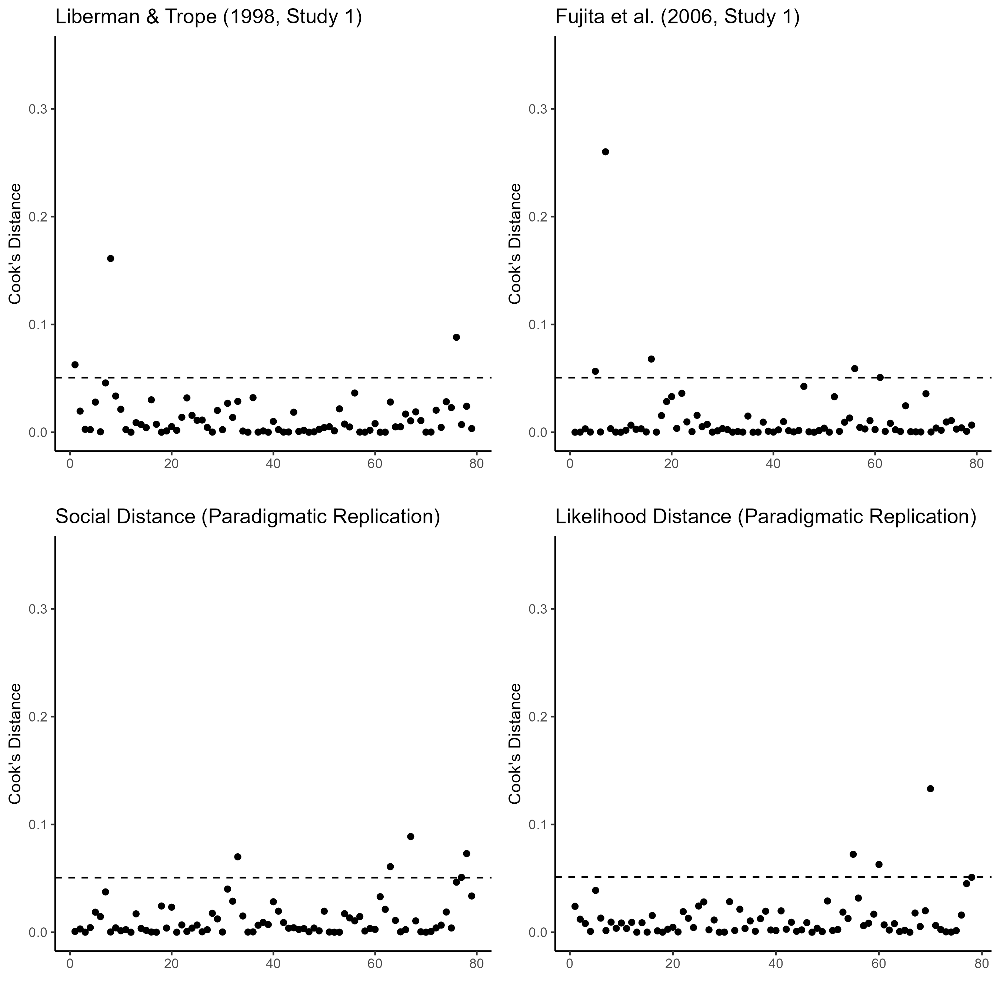

Construal Level International Multilab Replication (CLIMR) Project:
Exploration of Influential Cases
================
CLIMR Team
2024-11-28

# Overview of Cook’s Distances

``` r

```


# Liberman & Trope (1998, Study 1) - Influential cases removed

``` r
meta_temporal_inf
```

    ## 
    ## Random-Effects Model (k = 76; tau^2 estimator: REML)
    ## 
    ## tau^2 (estimated amount of total heterogeneity): 0.0000 (SE = 0.0156)
    ## tau (square root of estimated tau^2 value):      0.0010
    ## I^2 (total heterogeneity / total variability):   0.00%
    ## H^2 (total variability / sampling variability):  1.00
    ## 
    ## Test for Heterogeneity:
    ## Q(df = 75) = 76.1287, p-val = 0.4419
    ## 
    ## Model Results:
    ## 
    ## estimate      se    zval    pval   ci.lb   ci.ub     
    ##   0.1130  0.0380  2.9733  0.0029  0.0385  0.1875  ** 
    ## 
    ## ---
    ## Signif. codes:  0 '***' 0.001 '**' 0.01 '*' 0.05 '.' 0.1 ' ' 1

# Fujita et al. (2006, Study 1) - Influential cases removed

``` r
meta_spatial_inf
```

    ## 
    ## Random-Effects Model (k = 74; tau^2 estimator: REML)
    ## 
    ## tau^2 (estimated amount of total heterogeneity): 0 (SE = 0.0161)
    ## tau (square root of estimated tau^2 value):      0
    ## I^2 (total heterogeneity / total variability):   0.00%
    ## H^2 (total variability / sampling variability):  1.00
    ## 
    ## Test for Heterogeneity:
    ## Q(df = 73) = 49.1799, p-val = 0.9854
    ## 
    ## Model Results:
    ## 
    ## estimate      se    zval    pval    ci.lb   ci.ub    
    ##   0.0419  0.0390  1.0744  0.2827  -0.0345  0.1183    
    ## 
    ## ---
    ## Signif. codes:  0 '***' 0.001 '**' 0.01 '*' 0.05 '.' 0.1 ' ' 1

# Social Distance (Paradigmatic Replication) - Influential cases removed

``` r
meta_social_inf
```

    ## 
    ## Random-Effects Model (k = 74; tau^2 estimator: REML)
    ## 
    ## tau^2 (estimated amount of total heterogeneity): 0.0000 (SE = 0.0164)
    ## tau (square root of estimated tau^2 value):      0.0021
    ## I^2 (total heterogeneity / total variability):   0.00%
    ## H^2 (total variability / sampling variability):  1.00
    ## 
    ## Test for Heterogeneity:
    ## Q(df = 73) = 62.2244, p-val = 0.8116
    ## 
    ## Model Results:
    ## 
    ## estimate      se     zval    pval    ci.lb    ci.ub      
    ##  -0.2541  0.0394  -6.4518  <.0001  -0.3313  -0.1769  *** 
    ## 
    ## ---
    ## Signif. codes:  0 '***' 0.001 '**' 0.01 '*' 0.05 '.' 0.1 ' ' 1

# Likelihood Distance (Paradigmatic Replication) - Influential cases removed

``` r
meta_likelihood_inf
```

    ## 
    ## Random-Effects Model (k = 75; tau^2 estimator: REML)
    ## 
    ## tau^2 (estimated amount of total heterogeneity): 0.0000 (SE = 0.0156)
    ## tau (square root of estimated tau^2 value):      0.0012
    ## I^2 (total heterogeneity / total variability):   0.00%
    ## H^2 (total variability / sampling variability):  1.00
    ## 
    ## Test for Heterogeneity:
    ## Q(df = 74) = 69.6250, p-val = 0.6224
    ## 
    ## Model Results:
    ## 
    ## estimate      se    zval    pval    ci.lb   ci.ub    
    ##   0.0243  0.0383  0.6350  0.5254  -0.0508  0.0995    
    ## 
    ## ---
    ## Signif. codes:  0 '***' 0.001 '**' 0.01 '*' 0.05 '.' 0.1 ' ' 1
