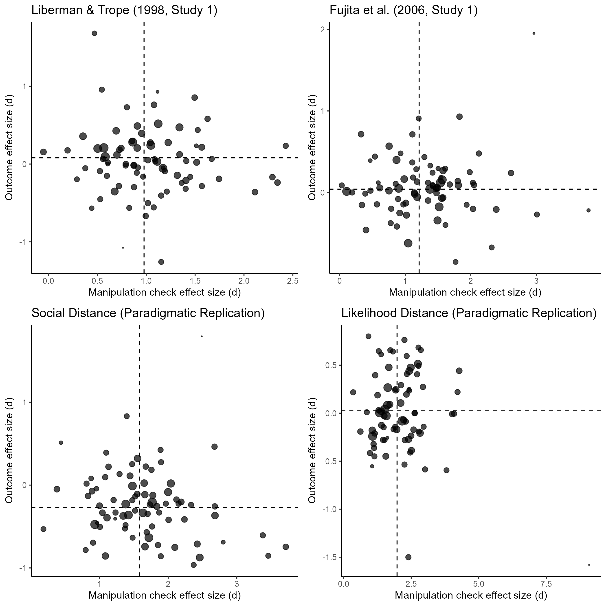

Construal Level International Multilab Replication (CLIMR) Project:
Exploration of Manipulation Check Effect Sizes (Cause Sizes) vs. Outcome
Effect Sizes
================
CLIMR Team
2024-11-28

# Overview

``` r

```


# Liberman & Trope (1998, Study 1)

``` r
meta_temporal_ce
```

    ## 
    ## Multivariate Meta-Analysis Model (k = 79; method: REML)
    ## 
    ## Variance Components: none
    ## 
    ## Test for Residual Heterogeneity:
    ## QE(df = 77) = 92.5257, p-val = 0.1096
    ## 
    ## Test of Moderators (coefficient 2):
    ## QM(df = 1) = 1.3575, p-val = 0.2440
    ## 
    ## Model Results:
    ## 
    ##          estimate      se     zval    pval    ci.lb   ci.ub    
    ## intrcpt    0.1819  0.0912   1.9933  0.0462   0.0030  0.3607  * 
    ## d_mc      -0.0971  0.0834  -1.1651  0.2440  -0.2606  0.0663    
    ## 
    ## ---
    ## Signif. codes:  0 '***' 0.001 '**' 0.01 '*' 0.05 '.' 0.1 ' ' 1

# Fujita et al. (2006, Study 1)

``` r
meta_spatial_ce
```

    ## 
    ## Multivariate Meta-Analysis Model (k = 78; method: REML)
    ## 
    ## Variance Components: none
    ## 
    ## Test for Residual Heterogeneity:
    ## QE(df = 76) = 71.1228, p-val = 0.6368
    ## 
    ## Test of Moderators (coefficient 2):
    ## QM(df = 1) = 0.0025, p-val = 0.9601
    ## 
    ## Model Results:
    ## 
    ##          estimate      se     zval    pval    ci.lb   ci.ub    
    ## intrcpt    0.0468  0.0885   0.5289  0.5969  -0.1266  0.2202    
    ## d_mc      -0.0032  0.0644  -0.0501  0.9601  -0.1294  0.1229    
    ## 
    ## ---
    ## Signif. codes:  0 '***' 0.001 '**' 0.01 '*' 0.05 '.' 0.1 ' ' 1

# Social Distance (Paradigmatic Replication)

``` r
meta_social_ce
```

    ## 
    ## Multivariate Meta-Analysis Model (k = 79; method: REML)
    ## 
    ## Variance Components: none
    ## 
    ## Test for Residual Heterogeneity:
    ## QE(df = 77) = 82.3159, p-val = 0.3183
    ## 
    ## Test of Moderators (coefficient 2):
    ## QM(df = 1) = 3.0922, p-val = 0.0787
    ## 
    ## Model Results:
    ## 
    ##          estimate      se     zval    pval    ci.lb   ci.ub    
    ## intrcpt   -0.0862  0.1110  -0.7765  0.4375  -0.3038  0.1314    
    ## d_mc      -0.1118  0.0636  -1.7585  0.0787  -0.2364  0.0128  . 
    ## 
    ## ---
    ## Signif. codes:  0 '***' 0.001 '**' 0.01 '*' 0.05 '.' 0.1 ' ' 1

# Likelihood Distance (Paradigmatic Replication)

``` r
meta_likelihood_ce
```

    ## 
    ## Multivariate Meta-Analysis Model (k = 78; method: REML)
    ## 
    ## Variance Components: none
    ## 
    ## Test for Residual Heterogeneity:
    ## QE(df = 76) = 92.0250, p-val = 0.1018
    ## 
    ## Test of Moderators (coefficient 2):
    ## QM(df = 1) = 0.0231, p-val = 0.8791
    ## 
    ## Model Results:
    ## 
    ##          estimate      se    zval    pval    ci.lb   ci.ub    
    ## intrcpt    0.0181  0.0978  0.1850  0.8532  -0.1736  0.2098    
    ## d_mc       0.0069  0.0453  0.1521  0.8791  -0.0818  0.0956    
    ## 
    ## ---
    ## Signif. codes:  0 '***' 0.001 '**' 0.01 '*' 0.05 '.' 0.1 ' ' 1
