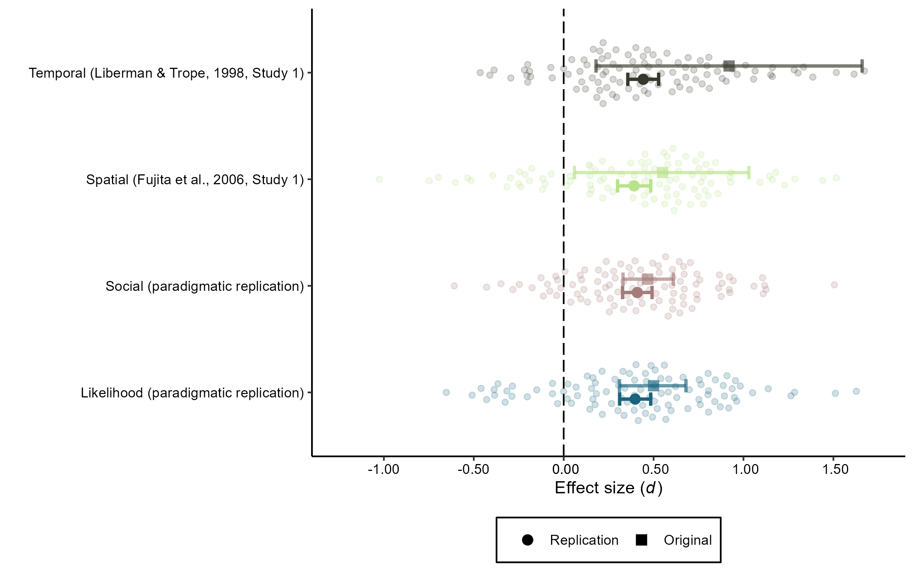
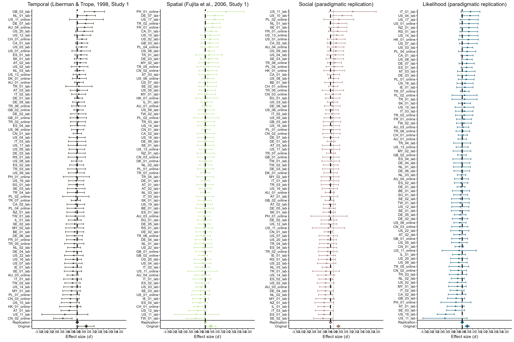

Construal Level International Multilab Replication (CLIMR) Project: Main
Analysis Report
================
CLIMR Team
2025-02-03

# Main Figure

``` r

```


# Meta-Analytic Models

## Liberman & Trope (1998, Study 1)

``` r
meta_temporal
```

    ## 
    ## Random-Effects Model (k = 79; tau^2 estimator: REML)
    ## 
    ## tau^2 (estimated amount of total heterogeneity): 0.0097 (SE = 0.0176)
    ## tau (square root of estimated tau^2 value):      0.0984
    ## I^2 (total heterogeneity / total variability):   8.07%
    ## H^2 (total variability / sampling variability):  1.09
    ## 
    ## Test for Heterogeneity:
    ## Q(df = 78) = 93.8832, p-val = 0.1062
    ## 
    ## Model Results:
    ## 
    ## estimate      se    zval    pval   ci.lb   ci.ub    
    ##   0.0798  0.0393  2.0298  0.0424  0.0027  0.1569  * 
    ## 
    ## ---
    ## Signif. codes:  0 '***' 0.001 '**' 0.01 '*' 0.05 '.' 0.1 ' ' 1

``` r
bt_temporal
```

    ##        diff   ci_lower ci_upper
    ## 1 0.3184154 0.01095177 0.625879

``` r
predict(meta_temporal)
```

    ## 
    ##    pred     se  ci.lb  ci.ub   pi.lb  pi.ub 
    ##  0.0798 0.0393 0.0027 0.1569 -0.1278 0.2875

## Fujita et al. (2006, Study 1)

``` r
meta_spatial
```

    ## 
    ## Random-Effects Model (k = 79; tau^2 estimator: REML)
    ## 
    ## tau^2 (estimated amount of total heterogeneity): 0.0000 (SE = 0.0150)
    ## tau (square root of estimated tau^2 value):      0.0026
    ## I^2 (total heterogeneity / total variability):   0.01%
    ## H^2 (total variability / sampling variability):  1.00
    ## 
    ## Test for Heterogeneity:
    ## Q(df = 78) = 72.1983, p-val = 0.6638
    ## 
    ## Model Results:
    ## 
    ## estimate      se    zval    pval    ci.lb   ci.ub    
    ##   0.0410  0.0370  1.1088  0.2675  -0.0315  0.1135    
    ## 
    ## ---
    ## Signif. codes:  0 '***' 0.001 '**' 0.01 '*' 0.05 '.' 0.1 ' ' 1

``` r
bt_spatial
```

    ##        diff    ci_lower  ci_upper
    ## 1 0.1107636 -0.08502635 0.3065536

``` r
predict(meta_spatial)
```

    ## 
    ##    pred     se   ci.lb  ci.ub   pi.lb  pi.ub 
    ##  0.0410 0.0370 -0.0315 0.1135 -0.0317 0.1136

## Social Distance (Paradigmatic Replication)

``` r
meta_social
```

    ## 
    ## Random-Effects Model (k = 79; tau^2 estimator: REML)
    ## 
    ## tau^2 (estimated amount of total heterogeneity): 0.0081 (SE = 0.0173)
    ## tau (square root of estimated tau^2 value):      0.0900
    ## I^2 (total heterogeneity / total variability):   6.77%
    ## H^2 (total variability / sampling variability):  1.07
    ## 
    ## Test for Heterogeneity:
    ## Q(df = 78) = 85.4081, p-val = 0.2649
    ## 
    ## Model Results:
    ## 
    ## estimate      se     zval    pval    ci.lb    ci.ub      
    ##  -0.2680  0.0393  -6.8233  <.0001  -0.3450  -0.1911  *** 
    ## 
    ## ---
    ## Signif. codes:  0 '***' 0.001 '**' 0.01 '*' 0.05 '.' 0.1 ' ' 1

``` r
bt_social
```

    ##       diff  ci_lower   ci_upper
    ## 1 -1.38679 -1.785142 -0.9884379

``` r
predict(meta_social)
```

    ## 
    ##     pred     se   ci.lb   ci.ub   pi.lb   pi.ub 
    ##  -0.2680 0.0393 -0.3450 -0.1911 -0.4606 -0.0755

## Likelihood Distance (Paradigmatic Replication)

``` r
meta_likelihood
```

    ## 
    ## Random-Effects Model (k = 78; tau^2 estimator: REML)
    ## 
    ## tau^2 (estimated amount of total heterogeneity): 0.0109 (SE = 0.0177)
    ## tau (square root of estimated tau^2 value):      0.1044
    ## I^2 (total heterogeneity / total variability):   9.11%
    ## H^2 (total variability / sampling variability):  1.10
    ## 
    ## Test for Heterogeneity:
    ## Q(df = 77) = 92.0481, p-val = 0.1161
    ## 
    ## Model Results:
    ## 
    ## estimate      se    zval    pval    ci.lb   ci.ub    
    ##   0.0314  0.0397  0.7926  0.4280  -0.0463  0.1091    
    ## 
    ## ---
    ## Signif. codes:  0 '***' 0.001 '**' 0.01 '*' 0.05 '.' 0.1 ' ' 1

``` r
bt_likelihood
```

    ##        diff    ci_lower  ci_upper
    ## 1 0.0636951 -0.09380308 0.2211933

``` r
predict(meta_likelihood)
```

    ## 
    ##    pred     se   ci.lb  ci.ub   pi.lb  pi.ub 
    ##  0.0314 0.0397 -0.0463 0.1091 -0.1875 0.2504

# Arboretum

``` r

```


