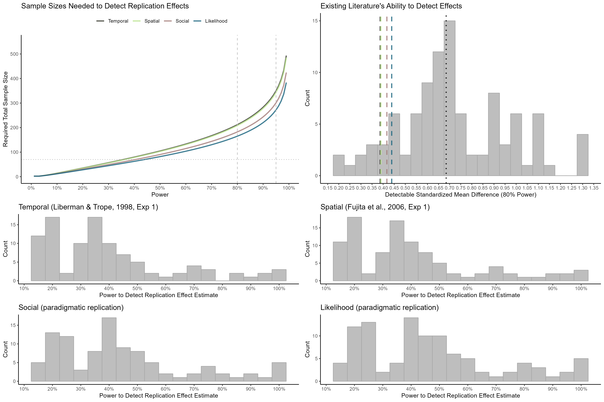

Construal Level International Multilab Replication (CLIMR) Project:
Power Analysis Report
================
CLIMR Team
2022-12-18

# **THESE RESULTS ARE SIMULATED. DO NOT INTERPRET.**

# Power Figure

``` r

```

<!-- -->

# Power Analyses for Each Replication

## Liberman & Trope (1998, Study 1)

### What sample sizes are needed for 80% and 95% power to detect the replication effect?

``` r
power_80_n_temporal
```

    ## [1] 211.9376

``` r
power_95_n_temporal
```

    ## [1] 349.6109

### What proportion of previous experiments had at least 80% power to detect effects the size of the replication effect?

``` r
smaller_prop_temporal
```

    ## [1] 0.08

### What is the median power for the replication effect that the previous experiments samples provided?

``` r
median_power_temporal
```

    ## [1] 0.3530552

## Fujita et al. (2006, Study 1)

### What sample sizes are needed for 80% and 95% power to detect the replication effect?

``` r
power_80_n_spatial
```

    ## [1] 208.3361

``` r
power_95_n_spatial
```

    ## [1] 343.6478

### What proportion of previous experiments had at least 80% power to detect effects the size of the replication effect?

``` r
smaller_prop_spatial
```

    ## [1] 0.08

### What is the median power for the replication effect that the previous experiments samples provided?

``` r
median_power_spatial
```

    ## [1] 0.358177

## Social Distance (Paradigmatic Replication)

### What sample sizes are needed for 80% and 95% power to detect the replication effect?

``` r
power_80_n_social
```

    ## [1] 182.5

``` r
power_95_n_social
```

    ## [1] 300.8708

### What proportion of previous experiments had at least 80% power to detect effects the size of the replication effect?

``` r
smaller_prop_social
```

    ## [1] 0.11

### What is the median power for the replication effect that the previous experiments samples provided?

``` r
median_power_social
```

    ## [1] 0.4001598

## Likelihood Distance (Paradigmatic Replication)

### What sample sizes are needed for 80% and 95% power to detect the replication effect?

``` r
power_80_n_likelihood
```

    ## [1] 165.0363

``` r
power_95_n_likelihood
```

    ## [1] 271.9557

### What proportion of effects for which previous experiments had 80% power is the replication effect smaller than?

``` r
smaller_prop_likelihood
```

    ## [1] 0.14

### What is the median power for the replication effect that the previous experiments samples provided?

``` r
median_power_likelihood
```

    ## [1] 0.4349158
