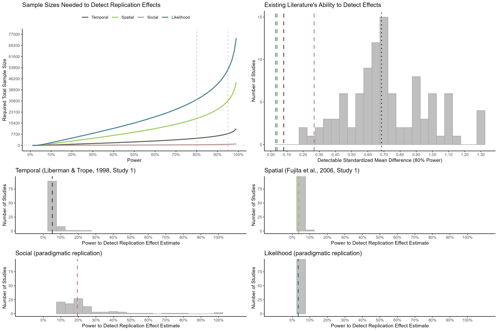

Construal Level International Multilab Replication (CLIMR) Project:
Power Analysis Report
================
CLIMR Team
2025-01-07

# Power Figure

``` r

```


# Power Analyses for Each Replication

## Liberman & Trope (1998, Study 1)

### What sample sizes are needed for 80% and 95% power to detect the replication effect?

``` r
power_80_n_temporal
```

    ## [1] 4926.155

``` r
power_95_n_temporal
```

    ## [1] 8154.548

### What proportion of previous experiments had at least 80% power to detect effects the size of the replication effect?

``` r
smaller_prop_temporal
```

    ## [1] 0

### What is the median power for the replication effect that the previous experiments samples provided?

``` r
median_power_temporal
```

    ## [1] 0.05122862

## Fujita et al. (2006, Study 1)

### What sample sizes are needed for 80% and 95% power to detect the replication effect?

``` r
power_80_n_spatial
```

    ## [1] 18681.75

``` r
power_95_n_spatial
```

    ## [1] 30928.49

### What proportion of previous experiments had at least 80% power to detect effects the size of the replication effect?

``` r
smaller_prop_spatial
```

    ## [1] 0

### What is the median power for the replication effect that the previous experiments samples provided?

``` r
median_power_spatial
```

    ## [1] 0.03655702

## Social Distance (Paradigmatic Replication)

### What sample sizes are needed for 80% and 95% power to detect the replication effect?

``` r
power_80_n_social
```

    ## [1] 438.8856

``` r
power_95_n_social
```

    ## [1] 725.3576

### What proportion of previous experiments had at least 80% power to detect effects the size of the replication effect?

``` r
smaller_prop_social
```

    ## [1] 0.02

### What is the median power for the replication effect that the previous experiments samples provided?

``` r
median_power_social
```

    ## [1] 0.1941831

## Likelihood Distance (Paradigmatic Replication)

### What sample sizes are needed for 80% and 95% power to detect the replication effect?

``` r
power_80_n_likelihood
```

    ## [1] 31786.95

``` r
power_95_n_likelihood
```

    ## [1] 52625.64

### What proportion of effects for which previous experiments had 80% power is the replication effect smaller than?

``` r
smaller_prop_likelihood
```

    ## [1] 0

### What is the median power for the replication effect that the previous experiments samples provided?

``` r
median_power_likelihood
```

    ## [1] 0.03352853
