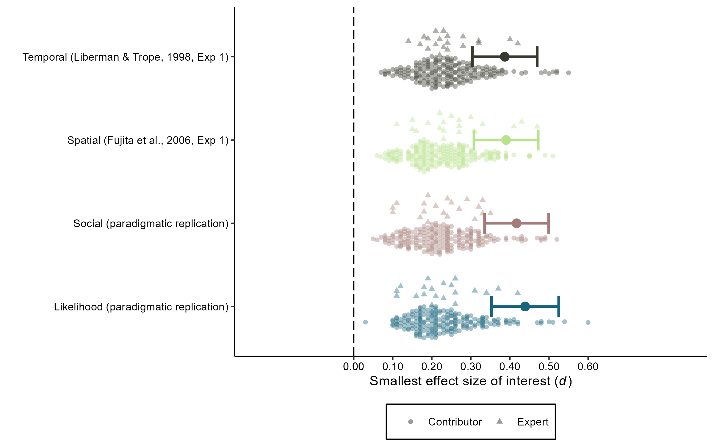

Construal Level International Multilab Replication (CLIMR) Project:
Smallest Effect Size of Interest (SEOI) Report
================
CLIMR Team
2022-11-04

# **THESE RESULTS ARE SIMULATED. DO NOT INTERPRET.**

# Primary SEOI Visualization

``` r

```

<!-- -->

# Frequencies and Proportions of Excluded SEOI Estimates

## Liberman & Trope (1998, Study 1)

``` r
seoi_temporal
```

    ##   seoi_contr_count seoi_contr_prop seoi_clt_count seoi_clt_prop
    ## 1                7         0.00875              0             0

## Fujita et al. (2006, Study 1)

``` r
seoi_spatial
```

    ##   seoi_contr_count seoi_contr_prop seoi_clt_count seoi_clt_prop
    ## 1                7         0.00875              0             0

## Social Distance (Conceptual Replication)

``` r
seoi_social
```

    ##   seoi_contr_count seoi_contr_prop seoi_clt_count seoi_clt_prop
    ## 1                5         0.00625              0             0

## Likelihood Distance (Conceptual Replication)

``` r
seoi_likelihood
```

    ##   seoi_contr_count seoi_contr_prop seoi_clt_count seoi_clt_prop
    ## 1                1         0.00125              0             0
