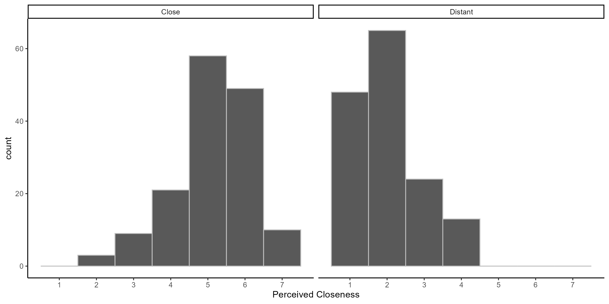

Construal Level International Multilab Replication (CLIMR) Project:
Pretest of Social distance Manipulation
================
CLIMR Team
2022-11-09

# Overview

The documentation for this pretest is provided here:
<https://osf.io/ahyvj/>

# Effect of Social Distance Manipulation on Ratings of Closeness

``` r
distance_d
```

    ##                ID        d        var ci_lower ci_upper
    ## 1 Social Distance 3.147686 0.02995737 2.807068 3.488304

``` r

```

<!-- -->

``` r
close_cor_mat
```

    ##              close_rating      warm competent  likeable   skilled conventional   eccentric     immune
    ## close_rating    1.0000000 0.6307766 0.4781747 0.7028595 0.3223844   0.22927058  0.16790741 0.25290007
    ## warm            0.6307766 1.0000000 0.5933399 0.7497020 0.4822025   0.39189926  0.16100365 0.23058045
    ## competent       0.4781747 0.5933399 1.0000000 0.6168244 0.7300458   0.40278238  0.12882262 0.26513568
    ## likeable        0.7028595 0.7497020 0.6168244 1.0000000 0.4956516   0.32211748  0.19664847 0.25067026
    ## skilled         0.3223844 0.4822025 0.7300458 0.4956516 1.0000000   0.45680131  0.17655240 0.27846678
    ## conventional    0.2292706 0.3918993 0.4027824 0.3221175 0.4568013   1.00000000 -0.02091811 0.22027025
    ## eccentric       0.1679074 0.1610037 0.1288226 0.1966485 0.1765524  -0.02091811  1.00000000 0.01956791
    ## immune          0.2529001 0.2305804 0.2651357 0.2506703 0.2784668   0.22027025  0.01956791 1.00000000
