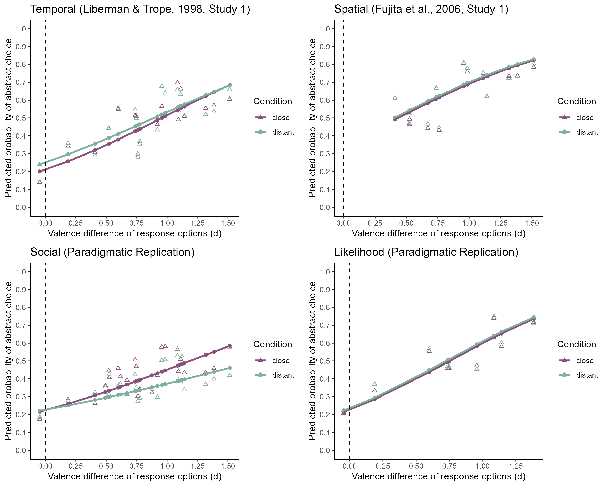

Construal Level International Multilab Replication (CLIMR) Project:
Robustness Tests Accounting for Valence Differences in the Response
Options for the Items on the Behavior Identification Form (BIF)
================
CLIMR Team
2025-05-22

# Predictions from Retained Models

``` r
knitr::include_graphics("figures/climr_bif-valence-predictions.png")
```


# Liberman & Trope (1998, Study 1)

``` r
lrt_val_temporal
```

    ## Data: data_bif_temporal
    ## Models:
    ## glmm_temporal_bif_base: bif ~ condition + (1 | lab:sub) + (1 | lab) + (1 | item)
    ## glmm_temporal_bif_val: bif ~ condition + d + (1 | lab:sub) + (1 | lab) + (1 | item)
    ## glmm_temporal_bif_int: bif ~ condition * d + (1 | lab:sub) + (1 | lab) + (1 | item)
    ##                        npar   AIC   BIC logLik deviance   Chisq Df Pr(>Chisq)    
    ## glmm_temporal_bif_base    5 68917 68962 -34454    68907                          
    ## glmm_temporal_bif_val     6 68902 68956 -34445    68890 16.7904  1  4.174e-05 ***
    ## glmm_temporal_bif_int     7 68896 68958 -34441    68882  8.8605  1   0.002914 ** 
    ## ---
    ## Signif. codes:  0 '***' 0.001 '**' 0.01 '*' 0.05 '.' 0.1 ' ' 1

``` r
summary(glmm_temporal_bif_base)
```

    ## Generalized linear mixed model fit by maximum likelihood (Laplace Approximation) ['glmerMod']
    ##  Family: binomial  ( logit )
    ## Formula: bif ~ condition + (1 | lab:sub) + (1 | lab) + (1 | item)
    ##    Data: data_bif_temporal
    ## 
    ##      AIC      BIC   logLik deviance df.resid 
    ##  68917.2  68961.8 -34453.6  68907.2    55820 
    ## 
    ## Scaled residuals: 
    ##     Min      1Q  Median      3Q     Max 
    ## -3.4415 -0.7830 -0.2952  0.7887  4.8011 
    ## 
    ## Random effects:
    ##  Groups  Name        Variance Std.Dev.
    ##  lab:sub (Intercept) 0.76428  0.8742  
    ##  lab     (Intercept) 0.09057  0.3009  
    ##  item    (Intercept) 0.43897  0.6625  
    ## Number of obs: 55825, groups:  lab:sub, 2939; lab, 78; item, 19
    ## 
    ## Fixed effects:
    ##                  Estimate Std. Error z value Pr(>|z|)  
    ## (Intercept)      -0.13910    0.15811  -0.880   0.3790  
    ## conditiondistant  0.09094    0.03751   2.424   0.0153 *
    ## ---
    ## Signif. codes:  0 '***' 0.001 '**' 0.01 '*' 0.05 '.' 0.1 ' ' 1
    ## 
    ## Correlation of Fixed Effects:
    ##             (Intr)
    ## condtndstnt -0.118

``` r
summary(glmm_temporal_bif_val)
```

    ## Generalized linear mixed model fit by maximum likelihood (Laplace Approximation) ['glmerMod']
    ##  Family: binomial  ( logit )
    ## Formula: bif ~ condition + d + (1 | lab:sub) + (1 | lab) + (1 | item)
    ##    Data: data_bif_temporal
    ## 
    ##      AIC      BIC   logLik deviance df.resid 
    ##  68902.4  68956.0 -34445.2  68890.4    55819 
    ## 
    ## Scaled residuals: 
    ##     Min      1Q  Median      3Q     Max 
    ## -3.4377 -0.7829 -0.2949  0.7886  4.8093 
    ## 
    ## Random effects:
    ##  Groups  Name        Variance Std.Dev.
    ##  lab:sub (Intercept) 0.76428  0.8742  
    ##  lab     (Intercept) 0.09044  0.3007  
    ##  item    (Intercept) 0.18037  0.4247  
    ## Number of obs: 55825, groups:  lab:sub, 2939; lab, 78; item, 19
    ## 
    ## Fixed effects:
    ##                  Estimate Std. Error z value Pr(>|z|)    
    ## (Intercept)      -1.25090    0.23957  -5.221 1.78e-07 ***
    ## conditiondistant  0.09094    0.03752   2.424   0.0154 *  
    ## d                 1.30346    0.25116   5.190 2.10e-07 ***
    ## ---
    ## Signif. codes:  0 '***' 0.001 '**' 0.01 '*' 0.05 '.' 0.1 ' ' 1
    ## 
    ## Correlation of Fixed Effects:
    ##             (Intr) cndtnd
    ## condtndstnt -0.079       
    ## d           -0.895  0.001

``` r
summary(glmm_temporal_bif_int)
```

    ## Generalized linear mixed model fit by maximum likelihood (Laplace Approximation) ['glmerMod']
    ##  Family: binomial  ( logit )
    ## Formula: bif ~ condition * d + (1 | lab:sub) + (1 | lab) + (1 | item)
    ##    Data: data_bif_temporal
    ## 
    ##      AIC      BIC   logLik deviance df.resid 
    ##  68895.5  68958.0 -34440.8  68881.5    55818 
    ## 
    ## Scaled residuals: 
    ##     Min      1Q  Median      3Q     Max 
    ## -3.3991 -0.7823 -0.2953  0.7881  4.9987 
    ## 
    ## Random effects:
    ##  Groups  Name        Variance Std.Dev.
    ##  lab:sub (Intercept) 0.76432  0.8743  
    ##  lab     (Intercept) 0.09047  0.3008  
    ##  item    (Intercept) 0.18054  0.4249  
    ## Number of obs: 55825, groups:  lab:sub, 2939; lab, 78; item, 19
    ## 
    ## Fixed effects:
    ##                    Estimate Std. Error z value Pr(>|z|)    
    ## (Intercept)        -1.31837    0.24112  -5.468 4.56e-08 ***
    ## conditiondistant    0.22418    0.05813   3.857 0.000115 ***
    ## d                   1.38051    0.25321   5.452 4.98e-08 ***
    ## conditiondistant:d -0.15268    0.05091  -2.999 0.002708 ** 
    ## ---
    ## Signif. codes:  0 '***' 0.001 '**' 0.01 '*' 0.05 '.' 0.1 ' ' 1
    ## 
    ## Correlation of Fixed Effects:
    ##             (Intr) cndtnd d     
    ## condtndstnt -0.123              
    ## d           -0.896  0.079       
    ## cndtndstnt:  0.095 -0.764 -0.103

# Fujita et al. (2006, Study 1)

``` r
lrt_val_spatial
```

    ## Data: data_bif_spatial
    ## Models:
    ## glmm_spatial_bif_base: bif ~ condition + (1 | lab:sub) + (1 | lab) + (1 | item)
    ## glmm_spatial_bif_val: bif ~ condition + d + (1 | lab:sub) + (1 | lab) + (1 | item)
    ## glmm_spatial_bif_int: bif ~ condition * d + (1 | lab:sub) + (1 | lab) + (1 | item)
    ##                       npar   AIC   BIC logLik deviance  Chisq Df Pr(>Chisq)   
    ## glmm_spatial_bif_base    5 45204 45247 -22597    45194                        
    ## glmm_spatial_bif_val     6 45197 45249 -22593    45185 9.2108  1   0.002406 **
    ## glmm_spatial_bif_int     7 45199 45259 -22592    45185 0.5320  1   0.465766   
    ## ---
    ## Signif. codes:  0 '***' 0.001 '**' 0.01 '*' 0.05 '.' 0.1 ' ' 1

``` r
summary(glmm_spatial_bif_base)
```

    ## Generalized linear mixed model fit by maximum likelihood (Laplace Approximation) ['glmerMod']
    ##  Family: binomial  ( logit )
    ## Formula: bif ~ condition + (1 | lab:sub) + (1 | lab) + (1 | item)
    ##    Data: data_bif_spatial
    ## 
    ##      AIC      BIC   logLik deviance df.resid 
    ##  45204.4  45247.2 -22597.2  45194.4    38617 
    ## 
    ## Scaled residuals: 
    ##     Min      1Q  Median      3Q     Max 
    ## -3.9117 -0.8243  0.4212  0.6497  2.9670 
    ## 
    ## Random effects:
    ##  Groups  Name        Variance Std.Dev.
    ##  lab:sub (Intercept) 0.77657  0.8812  
    ##  lab     (Intercept) 0.06495  0.2549  
    ##  item    (Intercept) 0.45937  0.6778  
    ## Number of obs: 38622, groups:  lab:sub, 2971; lab, 78; item, 13
    ## 
    ## Fixed effects:
    ##                  Estimate Std. Error z value Pr(>|z|)    
    ## (Intercept)       0.70039    0.19248   3.639 0.000274 ***
    ## conditiondistant  0.04479    0.04026   1.112 0.265986    
    ## ---
    ## Signif. codes:  0 '***' 0.001 '**' 0.01 '*' 0.05 '.' 0.1 ' ' 1
    ## 
    ## Correlation of Fixed Effects:
    ##             (Intr)
    ## condtndstnt -0.104

``` r
summary(glmm_spatial_bif_val)
```

    ## Generalized linear mixed model fit by maximum likelihood (Laplace Approximation) ['glmerMod']
    ##  Family: binomial  ( logit )
    ## Formula: bif ~ condition + d + (1 | lab:sub) + (1 | lab) + (1 | item)
    ##    Data: data_bif_spatial
    ## 
    ##      AIC      BIC   logLik deviance df.resid 
    ##  45197.2  45248.5 -22592.6  45185.2    38616 
    ## 
    ## Scaled residuals: 
    ##     Min      1Q  Median      3Q     Max 
    ## -3.9040 -0.8237  0.4214  0.6502  2.9644 
    ## 
    ## Random effects:
    ##  Groups  Name        Variance Std.Dev.
    ##  lab:sub (Intercept) 0.7766   0.8812  
    ##  lab     (Intercept) 0.0649   0.2547  
    ##  item    (Intercept) 0.2252   0.4746  
    ## Number of obs: 38622, groups:  lab:sub, 2971; lab, 78; item, 13
    ## 
    ## Fixed effects:
    ##                  Estimate Std. Error z value Pr(>|z|)    
    ## (Intercept)      -0.61207    0.38218  -1.602 0.109259    
    ## conditiondistant  0.04479    0.04026   1.112 0.265972    
    ## d                 1.41727    0.38524   3.679 0.000234 ***
    ## ---
    ## Signif. codes:  0 '***' 0.001 '**' 0.01 '*' 0.05 '.' 0.1 ' ' 1
    ## 
    ## Correlation of Fixed Effects:
    ##             (Intr) cndtnd
    ## condtndstnt -0.052       
    ## d           -0.933  0.000

``` r
summary(glmm_spatial_bif_int)
```

    ## Generalized linear mixed model fit by maximum likelihood (Laplace Approximation) ['glmerMod']
    ##  Family: binomial  ( logit )
    ## Formula: bif ~ condition * d + (1 | lab:sub) + (1 | lab) + (1 | item)
    ##    Data: data_bif_spatial
    ## 
    ##      AIC      BIC   logLik deviance df.resid 
    ##  45198.6  45258.6 -22592.3  45184.6    38615 
    ## 
    ## Scaled residuals: 
    ##     Min      1Q  Median      3Q     Max 
    ## -3.8986 -0.8235  0.4217  0.6496  2.9567 
    ## 
    ## Random effects:
    ##  Groups  Name        Variance Std.Dev.
    ##  lab:sub (Intercept) 0.77665  0.8813  
    ##  lab     (Intercept) 0.06491  0.2548  
    ##  item    (Intercept) 0.22522  0.4746  
    ## Number of obs: 38622, groups:  lab:sub, 2971; lab, 78; item, 13
    ## 
    ## Fixed effects:
    ##                    Estimate Std. Error z value Pr(>|z|)    
    ## (Intercept)        -0.63495    0.38110  -1.666 0.095693 .  
    ## conditiondistant    0.09053    0.07410   1.222 0.221772    
    ## d                   1.44301    0.38423   3.756 0.000173 ***
    ## conditiondistant:d -0.05156    0.06985  -0.738 0.460417    
    ## ---
    ## Signif. codes:  0 '***' 0.001 '**' 0.01 '*' 0.05 '.' 0.1 ' ' 1
    ## 
    ## Correlation of Fixed Effects:
    ##             (Intr) cndtnd d     
    ## condtndstnt -0.096              
    ## d           -0.932  0.075       
    ## cndtndstnt:  0.080 -0.839 -0.089

# Social Distance (Paradigmatic Replication)

``` r
lrt_val_social
```

    ## Data: data_bif_social
    ## Models:
    ## glmm_social_bif_base: bif ~ condition + (1 | lab:sub) + (1 | lab) + (1 | item)
    ## glmm_social_bif_val: bif ~ condition + d + (1 | lab:sub) + (1 | lab) + (1 | item)
    ## glmm_social_bif_int: bif ~ condition * d + (1 | lab:sub) + (1 | lab) + (1 | item)
    ##                      npar   AIC   BIC logLik deviance  Chisq Df Pr(>Chisq)    
    ## glmm_social_bif_base    5 88938 88984 -44464    88928                         
    ## glmm_social_bif_val     6 88924 88979 -44456    88912 16.159  1  5.823e-05 ***
    ## glmm_social_bif_int     7 88877 88941 -44431    88863 49.066  1  2.474e-12 ***
    ## ---
    ## Signif. codes:  0 '***' 0.001 '**' 0.01 '*' 0.05 '.' 0.1 ' ' 1

``` r
summary(glmm_social_bif_base)
```

    ## Generalized linear mixed model fit by maximum likelihood (Laplace Approximation) ['glmerMod']
    ##  Family: binomial  ( logit )
    ## Formula: bif ~ condition + (1 | lab:sub) + (1 | lab) + (1 | item)
    ##    Data: data_bif_social
    ## 
    ##      AIC      BIC   logLik deviance df.resid 
    ##  88937.9  88983.9 -44463.9  88927.9    73045 
    ## 
    ## Scaled residuals: 
    ##     Min      1Q  Median      3Q     Max 
    ## -3.1643 -0.7262 -0.4341  0.8756  5.2842 
    ## 
    ## Random effects:
    ##  Groups  Name        Variance Std.Dev.
    ##  lab:sub (Intercept) 0.84922  0.9215  
    ##  lab     (Intercept) 0.04908  0.2215  
    ##  item    (Intercept) 0.20956  0.4578  
    ## Number of obs: 73050, groups:  lab:sub, 2923; lab, 78; item, 25
    ## 
    ## Fixed effects:
    ##                  Estimate Std. Error z value Pr(>|z|)    
    ## (Intercept)      -0.37912    0.09895  -3.832 0.000127 ***
    ## conditiondistant -0.27093    0.03814  -7.104 1.21e-12 ***
    ## ---
    ## Signif. codes:  0 '***' 0.001 '**' 0.01 '*' 0.05 '.' 0.1 ' ' 1
    ## 
    ## Correlation of Fixed Effects:
    ##             (Intr)
    ## condtndstnt -0.192

``` r
summary(glmm_social_bif_val)
```

    ## Generalized linear mixed model fit by maximum likelihood (Laplace Approximation) ['glmerMod']
    ##  Family: binomial  ( logit )
    ## Formula: bif ~ condition + d + (1 | lab:sub) + (1 | lab) + (1 | item)
    ##    Data: data_bif_social
    ## 
    ##      AIC      BIC   logLik deviance df.resid 
    ##  88923.7  88978.9 -44455.9  88911.7    73044 
    ## 
    ## Scaled residuals: 
    ##     Min      1Q  Median      3Q     Max 
    ## -3.1596 -0.7260 -0.4336  0.8755  5.2956 
    ## 
    ## Random effects:
    ##  Groups  Name        Variance Std.Dev.
    ##  lab:sub (Intercept) 0.84922  0.9215  
    ##  lab     (Intercept) 0.04897  0.2213  
    ##  item    (Intercept) 0.10903  0.3302  
    ## Number of obs: 73050, groups:  lab:sub, 2923; lab, 78; item, 25
    ## 
    ## Fixed effects:
    ##                  Estimate Std. Error z value Pr(>|z|)    
    ## (Intercept)      -1.09943    0.16845  -6.527 6.71e-11 ***
    ## conditiondistant -0.27092    0.03814  -7.104 1.21e-12 ***
    ## d                 0.87794    0.18339   4.787 1.69e-06 ***
    ## ---
    ## Signif. codes:  0 '***' 0.001 '**' 0.01 '*' 0.05 '.' 0.1 ' ' 1
    ## 
    ## Correlation of Fixed Effects:
    ##             (Intr) cndtnd
    ## condtndstnt -0.112       
    ## d           -0.893 -0.001

``` r
summary(glmm_social_bif_int)
```

    ## Generalized linear mixed model fit by maximum likelihood (Laplace Approximation) ['glmerMod']
    ##  Family: binomial  ( logit )
    ## Formula: bif ~ condition * d + (1 | lab:sub) + (1 | lab) + (1 | item)
    ##    Data: data_bif_social
    ## 
    ##      AIC      BIC   logLik deviance df.resid 
    ##  88876.6  88941.0 -44431.3  88862.6    73043 
    ## 
    ## Scaled residuals: 
    ##     Min      1Q  Median      3Q     Max 
    ## -3.2126 -0.7234 -0.4339  0.8703  4.8944 
    ## 
    ## Random effects:
    ##  Groups  Name        Variance Std.Dev.
    ##  lab:sub (Intercept) 0.85182  0.9229  
    ##  lab     (Intercept) 0.04912  0.2216  
    ##  item    (Intercept) 0.10907  0.3303  
    ## Number of obs: 73050, groups:  lab:sub, 2923; lab, 78; item, 25
    ## 
    ## Fixed effects:
    ##                    Estimate Std. Error z value Pr(>|z|)    
    ## (Intercept)        -1.24032    0.17032  -7.282 3.28e-13 ***
    ## conditiondistant    0.01413    0.05554   0.254    0.799    
    ## d                   1.04513    0.18572   5.628 1.83e-08 ***
    ## conditiondistant:d -0.33749    0.04786  -7.052 1.76e-12 ***
    ## ---
    ## Signif. codes:  0 '***' 0.001 '**' 0.01 '*' 0.05 '.' 0.1 ' ' 1
    ## 
    ## Correlation of Fixed Effects:
    ##             (Intr) cndtnd d     
    ## condtndstnt -0.163              
    ## d           -0.895  0.094       
    ## cndtndstnt:  0.119 -0.726 -0.129

# Likelihood Distance (Paradigmatic Replication)

``` r
lrt_val_likelihood
```

    ## Data: data_bif_likelihood
    ## Models:
    ## glmm_likelihood_bif_base: bif ~ condition + (1 | lab:sub) + (1 | lab) + (1 | item)
    ## glmm_likelihood_bif_val: bif ~ condition + d + (1 | lab:sub) + (1 | lab) + (1 | item)
    ## glmm_likelihood_bif_int: bif ~ condition * d + (1 | lab:sub) + (1 | lab) + (1 | item)
    ##                          npar   AIC   BIC logLik deviance   Chisq Df Pr(>Chisq)    
    ## glmm_likelihood_bif_base    5 32813 32854 -16402    32803                          
    ## glmm_likelihood_bif_val     6 32801 32850 -16395    32789 14.2551  1  0.0001596 ***
    ## glmm_likelihood_bif_int     7 32800 32857 -16393    32786  3.0003  1  0.0832487 .  
    ## ---
    ## Signif. codes:  0 '***' 0.001 '**' 0.01 '*' 0.05 '.' 0.1 ' ' 1

``` r
summary(glmm_likelihood_bif_base)
```

    ## Generalized linear mixed model fit by maximum likelihood (Laplace Approximation) ['glmerMod']
    ##  Family: binomial  ( logit )
    ## Formula: bif ~ condition + (1 | lab:sub) + (1 | lab) + (1 | item)
    ##    Data: data_bif_likelihood
    ## 
    ##      AIC      BIC   logLik deviance df.resid 
    ##  32813.3  32854.2 -16401.7  32803.3    26409 
    ## 
    ## Scaled residuals: 
    ##     Min      1Q  Median      3Q     Max 
    ## -3.1989 -0.7995  0.3362  0.7633  3.0297 
    ## 
    ## Random effects:
    ##  Groups  Name        Variance Std.Dev.
    ##  lab:sub (Intercept) 0.67441  0.8212  
    ##  lab     (Intercept) 0.04129  0.2032  
    ##  item    (Intercept) 0.62025  0.7876  
    ## Number of obs: 26414, groups:  lab:sub, 2935; lab, 77; item, 9
    ## 
    ## Fixed effects:
    ##                  Estimate Std. Error z value Pr(>|z|)
    ## (Intercept)      0.003156   0.265004   0.012     0.99
    ## conditiondistant 0.045340   0.041084   1.104     0.27
    ## 
    ## Correlation of Fixed Effects:
    ##             (Intr)
    ## condtndstnt -0.077

``` r
summary(glmm_likelihood_bif_val)
```

    ## Generalized linear mixed model fit by maximum likelihood (Laplace Approximation) ['glmerMod']
    ##  Family: binomial  ( logit )
    ## Formula: bif ~ condition + d + (1 | lab:sub) + (1 | lab) + (1 | item)
    ##    Data: data_bif_likelihood
    ## 
    ##      AIC      BIC   logLik deviance df.resid 
    ##  32801.1  32850.1 -16394.5  32789.1    26408 
    ## 
    ## Scaled residuals: 
    ##     Min      1Q  Median      3Q     Max 
    ## -3.1906 -0.7992  0.3364  0.7617  3.0340 
    ## 
    ## Random effects:
    ##  Groups  Name        Variance Std.Dev.
    ##  lab:sub (Intercept) 0.67447  0.8213  
    ##  lab     (Intercept) 0.04123  0.2031  
    ##  item    (Intercept) 0.12589  0.3548  
    ## Number of obs: 26414, groups:  lab:sub, 2935; lab, 77; item, 9
    ## 
    ## Fixed effects:
    ##                  Estimate Std. Error z value Pr(>|z|)    
    ## (Intercept)      -1.22393    0.24257  -5.046 4.52e-07 ***
    ## conditiondistant  0.04534    0.04109   1.103     0.27    
    ## d                 1.62518    0.27579   5.893 3.80e-09 ***
    ## ---
    ## Signif. codes:  0 '***' 0.001 '**' 0.01 '*' 0.05 '.' 0.1 ' ' 1
    ## 
    ## Correlation of Fixed Effects:
    ##             (Intr) cndtnd
    ## condtndstnt -0.085       
    ## d           -0.859  0.001

``` r
summary(glmm_likelihood_bif_int)
```

    ## Generalized linear mixed model fit by maximum likelihood (Laplace Approximation) ['glmerMod']
    ##  Family: binomial  ( logit )
    ## Formula: bif ~ condition * d + (1 | lab:sub) + (1 | lab) + (1 | item)
    ##    Data: data_bif_likelihood
    ## 
    ##      AIC      BIC   logLik deviance df.resid 
    ##  32800.1  32857.3 -16393.0  32786.1    26407 
    ## 
    ## Scaled residuals: 
    ##     Min      1Q  Median      3Q     Max 
    ## -3.1550 -0.7999  0.3354  0.7630  3.1139 
    ## 
    ## Random effects:
    ##  Groups  Name        Variance Std.Dev.
    ##  lab:sub (Intercept) 0.67490  0.8215  
    ##  lab     (Intercept) 0.04127  0.2031  
    ##  item    (Intercept) 0.12592  0.3549  
    ## Number of obs: 26414, groups:  lab:sub, 2935; lab, 77; item, 9
    ## 
    ## Fixed effects:
    ##                    Estimate Std. Error z value Pr(>|z|)    
    ## (Intercept)        -1.26985    0.24309  -5.224 1.75e-07 ***
    ## conditiondistant    0.13605    0.06599   2.062   0.0392 *  
    ## d                   1.68491    0.27676   6.088 1.14e-09 ***
    ## conditiondistant:d -0.11846    0.06749  -1.755   0.0792 .  
    ## ---
    ## Signif. codes:  0 '***' 0.001 '**' 0.01 '*' 0.05 '.' 0.1 ' ' 1
    ## 
    ## Correlation of Fixed Effects:
    ##             (Intr) cndtnd d     
    ## condtndstnt -0.137              
    ## d           -0.860  0.097       
    ## cndtndstnt:  0.108 -0.782 -0.123

# Predictions from Retained Models, with Raw Proportions

``` r

```


