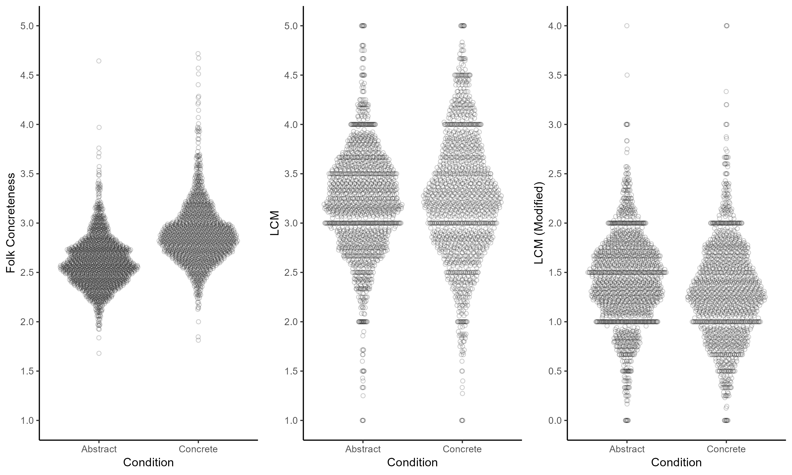
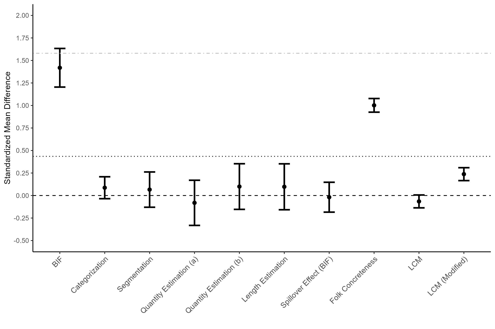

Construal Level International Multilab Replication (CLIMR) Project:
Linguistic Concreteness Validation
================
CLIMR Team
2024-04-29

These validations are documented here: <https://osf.io/kgrs9/>

Previous relevant analyses by the Puddle-Ducks can be found here:
<https://www.rabbitsnore.com/2019/02/there-might-be-problems-with-automated.html>

# Linguistic Measures of Concreteness/Abstraction

## Standarized mean differences

``` r
d_folk
```

    ##                  ID        d         var  ci_lower ci_upper
    ## 1 Folk Concreteness 1.001557 0.001493545 0.9257806 1.077333

``` r
d_lcm
```

    ##    ID           d         var   ci_lower    ci_upper
    ## 1 LCM -0.06532858 0.001328546 -0.1367964 0.006139257

``` r
d_lcm_pd
```

    ##               ID         d         var  ci_lower  ci_upper
    ## 1 LCM (Modified) 0.2374944 0.001337186 0.1657946 0.3091943

``` r

```


## Linear mixed effects models

``` r
summary(lmer_folk)
```

    ## Linear mixed model fit by REML. t-tests use Satterthwaite's method ['lmerModLmerTest']
    ## Formula: concreteness ~ 1 + distance + (1 + distance | ResponseId) + (1 |      item)
    ##    Data: linguistic_long
    ## Control: lmerControl(optimizer = "nlminbwrap")
    ## 
    ## REML criterion at convergence: 332
    ## 
    ## Scaled residuals: 
    ##     Min      1Q  Median      3Q     Max 
    ## -4.3767 -0.5843 -0.0631  0.5118  8.5920 
    ## 
    ## Random effects:
    ##  Groups     Name        Variance Std.Dev. Corr 
    ##  ResponseId (Intercept) 0.008639 0.09295       
    ##             distancec   0.037377 0.19333  -0.32
    ##  item       (Intercept) 0.005038 0.07098       
    ##  Residual               0.055873 0.23637       
    ## Number of obs: 3020, groups:  ResponseId, 302; item, 10
    ## 
    ## Fixed effects:
    ##              Estimate Std. Error        df t value Pr(>|t|)    
    ## (Intercept)   2.60347    0.02437  11.61433  106.83   <2e-16 ***
    ## distancec     0.28551    0.01920 228.64001   14.87   <2e-16 ***
    ## ---
    ## Signif. codes:  0 '***' 0.001 '**' 0.01 '*' 0.05 '.' 0.1 ' ' 1
    ## 
    ## Correlation of Fixed Effects:
    ##           (Intr)
    ## distancec -0.192
    ## optimizer (nlminbwrap) convergence code: 0 (OK)
    ## Model is nearly unidentifiable: large eigenvalue ratio
    ##  - Rescale variables?

``` r
summary(lmer_lcm)
```

    ## Linear mixed model fit by REML. t-tests use Satterthwaite's method ['lmerModLmerTest']
    ## Formula: lcm ~ 1 + distance + (1 + distance | ResponseId) + (1 | item)
    ##    Data: linguistic_long
    ## Control: lmerControl(optimizer = "bobyqa")
    ## 
    ## REML criterion at convergence: 5063.1
    ## 
    ## Scaled residuals: 
    ##     Min      1Q  Median      3Q     Max 
    ## -4.3705 -0.5719  0.0021  0.6124  3.6487 
    ## 
    ## Random effects:
    ##  Groups     Name        Variance Std.Dev. Corr 
    ##  ResponseId (Intercept) 0.02473  0.1572        
    ##             distancec   0.08951  0.2992   -0.84
    ##  item       (Intercept) 0.03896  0.1974        
    ##  Residual               0.28780  0.5365        
    ## Number of obs: 3019, groups:  ResponseId, 302; item, 10
    ## 
    ## Fixed effects:
    ##              Estimate Std. Error        df t value Pr(>|t|)    
    ## (Intercept)   3.20939    0.06507  10.12669  49.319 2.12e-13 ***
    ## distancec     0.03899    0.02793 289.91187   1.396    0.164    
    ## ---
    ## Signif. codes:  0 '***' 0.001 '**' 0.01 '*' 0.05 '.' 0.1 ' ' 1
    ## 
    ## Correlation of Fixed Effects:
    ##           (Intr)
    ## distancec -0.186
    ## optimizer (bobyqa) convergence code: 0 (OK)
    ## Model is nearly unidentifiable: large eigenvalue ratio
    ##  - Rescale variables?

``` r
summary(lmer_lcm_pd)
```

    ## Linear mixed model fit by REML. t-tests use Satterthwaite's method ['lmerModLmerTest']
    ## Formula: lcm_pd ~ 1 + distance + (1 + distance | ResponseId) + (1 | item)
    ##    Data: linguistic_long
    ## Control: lmerControl(optimizer = "nlminbwrap")
    ## 
    ## REML criterion at convergence: 3965.7
    ## 
    ## Scaled residuals: 
    ##     Min      1Q  Median      3Q     Max 
    ## -3.2396 -0.6076 -0.0239  0.5941  5.4582 
    ## 
    ## Random effects:
    ##  Groups     Name        Variance Std.Dev. Corr 
    ##  ResponseId (Intercept) 0.01567  0.1252        
    ##             distancec   0.08379  0.2895   -1.00
    ##  item       (Intercept) 0.01473  0.1214        
    ##  Residual               0.20025  0.4475        
    ## Number of obs: 3019, groups:  ResponseId, 302; item, 10
    ## 
    ## Fixed effects:
    ##              Estimate Std. Error        df t value Pr(>|t|)    
    ## (Intercept)   1.41625    0.04122  10.94855  34.359 1.68e-12 ***
    ## distancec    -0.11493    0.02351 284.62182  -4.889 1.69e-06 ***
    ## ---
    ## Signif. codes:  0 '***' 0.001 '**' 0.01 '*' 0.05 '.' 0.1 ' ' 1
    ## 
    ## Correlation of Fixed Effects:
    ##           (Intr)
    ## distancec -0.233
    ## optimizer (nlminbwrap) convergence code: 0 (OK)
    ## boundary (singular) fit: see help('isSingular')

# Additional LCM Analyses

## Effect for Activities Only

``` r
d_lcm_ac
```

    ##   ID         d         var  ci_lower  ci_upper
    ## 1  1 0.3306758 0.002692923 0.2288849 0.4324667

``` r
summary(lmer_lcm_ac)
```

    ## Linear mixed model fit by REML. t-tests use Satterthwaite's method ['lmerModLmerTest']
    ## Formula: lcm ~ 1 + distance + (1 + distance | ResponseId) + (1 | item)
    ##    Data: linguistic_long %>% filter(type == "ac")
    ## Control: lmerControl(optimizer = "bobyqa")
    ## 
    ## REML criterion at convergence: 2432
    ## 
    ## Scaled residuals: 
    ##     Min      1Q  Median      3Q     Max 
    ## -4.0907 -0.5800  0.0154  0.5835  3.9477 
    ## 
    ## Random effects:
    ##  Groups     Name        Variance Std.Dev. Corr 
    ##  ResponseId (Intercept) 0.017143 0.13093       
    ##             distancec   0.017971 0.13406  -0.02
    ##  item       (Intercept) 0.001644 0.04055       
    ##  Residual               0.269522 0.51916       
    ## Number of obs: 1509, groups:  ResponseId, 302; item, 5
    ## 
    ## Fixed effects:
    ##             Estimate Std. Error       df t value Pr(>|t|)    
    ## (Intercept)   3.1780     0.0279   9.2141 113.897 7.96e-16 ***
    ## distancec    -0.1794     0.0326 285.8306  -5.502 8.35e-08 ***
    ## ---
    ## Signif. codes:  0 '***' 0.001 '**' 0.01 '*' 0.05 '.' 0.1 ' ' 1
    ## 
    ## Correlation of Fixed Effects:
    ##           (Intr)
    ## distancec -0.494
    ## optimizer (bobyqa) convergence code: 0 (OK)
    ## Model is nearly unidentifiable: large eigenvalue ratio
    ##  - Rescale variables?

## Effect for Activities Only (Modified Puddle-Ducks Version)

``` r
d_lcm_pd_ac
```

    ##   ID         d         var  ci_lower ci_upper
    ## 1  1 0.5442957 0.002754937 0.4413394 0.647252

``` r
summary(lmer_lcm_pd_ac)
```

    ## Linear mixed model fit by REML. t-tests use Satterthwaite's method ['lmerModLmerTest']
    ## Formula: lcm_pd ~ 1 + distance + (1 + distance | ResponseId) + (1 | item)
    ##    Data: linguistic_long %>% filter(type == "ac")
    ## Control: lmerControl(optimizer = "nlminbwrap")
    ## 
    ## REML criterion at convergence: 1678.3
    ## 
    ## Scaled residuals: 
    ##     Min      1Q  Median      3Q     Max 
    ## -3.2722 -0.5717 -0.0262  0.5887  5.5965 
    ## 
    ## Random effects:
    ##  Groups     Name        Variance Std.Dev. Corr
    ##  ResponseId (Intercept) 0.019558 0.13985      
    ##             distancec   0.002738 0.05233  0.99
    ##  item       (Intercept) 0.019939 0.14121      
    ##  Residual               0.154402 0.39294      
    ## Number of obs: 1509, groups:  ResponseId, 302; item, 5
    ## 
    ## Fixed effects:
    ##              Estimate Std. Error        df t value Pr(>|t|)    
    ## (Intercept)   1.46616    0.06563   4.43472  22.340 9.97e-06 ***
    ## distancec    -0.24154    0.02809 279.54686  -8.598 5.88e-16 ***
    ## ---
    ## Signif. codes:  0 '***' 0.001 '**' 0.01 '*' 0.05 '.' 0.1 ' ' 1
    ## 
    ## Correlation of Fixed Effects:
    ##           (Intr)
    ## distancec -0.173
    ## optimizer (nlminbwrap) convergence code: 0 (OK)
    ## Model is nearly unidentifiable: large eigenvalue ratio
    ##  - Rescale variables?

# Summary of Validations Studies

``` r
validation_plot_data
```

    ##                         ID           d         var   ci_lower    ci_upper
    ## 1                      BIF  1.41884331 0.011898202  1.2044363 1.633250369
    ## 2           Categorization  0.08676957 0.003846699 -0.0349298 0.208468953
    ## 3             Segmentation  0.06592508 0.009921950 -0.1298945 0.261744651
    ## 4  Quantity Estimation (a) -0.08105716 0.016210130 -0.3318366 0.169722320
    ## 5  Quantity Estimation (b)  0.09970903 0.016549638 -0.1537092 0.353127287
    ## 6        Length Estimation  0.09718508 0.016756621 -0.1578293 0.352199495
    ## 7   Spillover Effect (BIF) -0.01850364 0.007171503 -0.1844826 0.147475375
    ## 8        Folk Concreteness  1.00155660 0.001493545  0.9257806 1.077332551
    ## 9                      LCM -0.06532858 0.001328546 -0.1367964 0.006139257
    ## 10          LCM (Modified)  0.23749445 0.001337186  0.1657946 0.309194301

``` r

```


