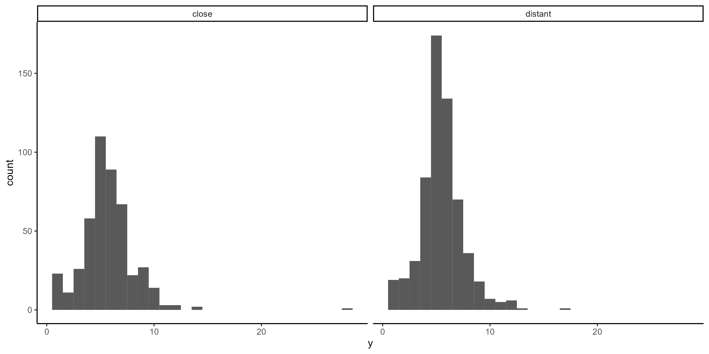
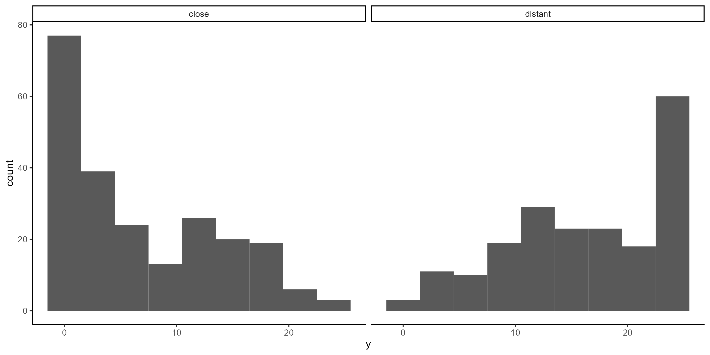

Construal Level International Multilab Replication (CLIMR) Project:
Validation Pretest Report
================
CLIMR Team
2024-04-29

These validation studies are documented here: <https://osf.io/kgrs9/>

# Categorization Task

``` r
effect_temporal
```

    ##               ID          d         var   ci_lower ci_upper
    ## 1 Categorization 0.08676957 0.003846699 -0.0349298 0.208469

``` r

```


# Segmentation Task

``` r
effect_spatial
```

    ##             ID          d        var   ci_lower  ci_upper
    ## 1 Segmentation 0.06592508 0.00992195 -0.1298945 0.2617447

``` r
knitr::include_graphics("./figures/climr_validation-spatial-hist.png")
```


# Behavior Identification Form

``` r
effect_temporal_2
```

    ##    ID        d       var ci_lower ci_upper
    ## 1 BIF 1.418843 0.0118982 1.204436  1.63325

``` r

```


# Robustness Checks

## Categorization Task

``` r
effect_temporal_cc
```

    ##   ID         d         var    ci_lower  ci_upper
    ## 1  1 0.1135343 0.004310192 -0.01530567 0.2423743

## Segmentation Task

``` r
effect_spatial_cc
```

    ##   ID         d       var    ci_lower  ci_upper
    ## 1  1 0.1480131 0.0111472 -0.05962247 0.3556486

## Behavior Identification Form

``` r
effect_temporal_2_cc
```

    ##   ID        d        var ci_lower ci_upper
    ## 1  1 1.468061 0.01244299  1.24878 1.687342
